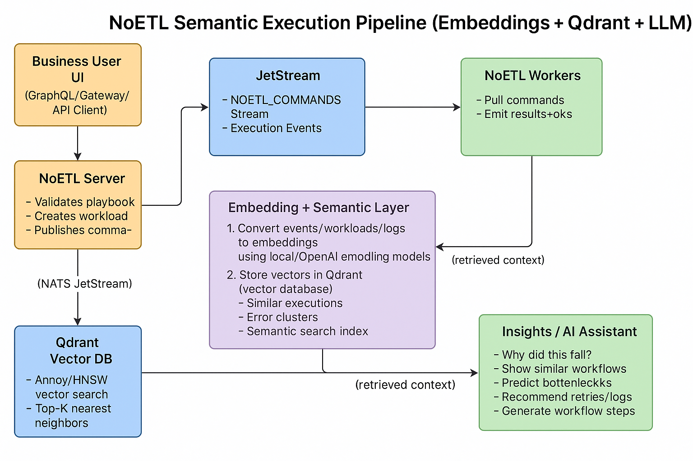

# Not Only ETL

__NoETL__ is an automation framework for Data Mash and MLOps orchestration.

[](https://badge.fury.io/py/noetl)


## Overview

The following diagram illustrates the main parts and intent of the NoETL system:


- **Server**: orchestration + API endpoints (catalog, credentials, tasks, events)
- **Worker**: background worker pool, no HTTP endpoints
- **Noetl CLI**: manages worker pools and server lifecycle

### Architecture

The following component view shows how NoETL is structured and how requests/data flow between parts of the system:


- Gateway/API
  - External entrypoint that exposes the public HTTP API used by CLIs, UIs, and integrations.
  - Handles authn/z and forwards requests to the Server.
- Orchestrator Server
  - Schedules and supervises workflow executions, manages retries/backoff, and records events.
  - Provides CRUD APIs for catalog (playbooks, tools), credentials, tasks, and events.
- Worker Pools
  - Stateless/background executors that run workflow steps and tools (HTTP, SQL engines, vector DBs, Python, etc.).
  - Scaled horizontally; no inbound HTTP endpoints.
- Scheduler & Queues
  - Internal priority queues for tasks, with resource-aware scheduling (CPU/GPU pools, concurrency limits).
  - Handles fan-out/fan-in and back-pressure across workflows, inspired by Petri nets.
- Catalog & Credentials
  - Catalog stores playbooks, versions, schemas, and tool definitions.
  - Credentials vault keeps connection configs and tokens with scoped access for steps.
- Event Bus and Telemetry
  - Every step emits structured events (start/finish/errors, durations, resource usage).
  - Events are exported to analytics backends (e.g., ClickHouse, VictoriaMetrics/Logs) and vector stores (e.g., Qdrant) for AI-assisted optimization and semantic search.
- Storage/Compute Integrations
  - Connectors for warehouses (DuckDB, Postgres, ClickHouse), files/lakes, vector DBs, and external services.
  - Results and artifacts are published as domain data products in a mesh/lakehouse.

This architecture enables domain-centric, AI-informed orchestration: the Server coordinates state and scheduling; Workers execute steps; telemetry and embeddings feed back into policies that optimize routing, hardware selection, and retry strategies over time.

### NoETL Semantic Execution Pipeline (Embeddings + Qdrant + LLM)

```
                            ┌──────────────────────────────┐
                            │        Business User UI      │
                            │ (GraphQL/Gateway/API Client) │
                            └───────────────┬──────────────┘
                                            │
                                            ▼
                                ┌──────────────────────┐
                                │     NoETL Server     │
                                │ - Validates playbook │
                                │ - Creates workload   │
                                │ - Publishes commands │
                                └─────────────┬────────┘
                                              │  (NATS JetStream)
                                              ▼
     ┌───────────────────────────┐     ┌-───────────────────────────┐
     │       JetStream           │     │        NoETL Workers       │
     │  - NOETL_COMMANDS Stream  │◀────│ - Pull commands            │
     │  - Execution Events       │────▶│ - Run tools / tasks        │
     └───────────┬──────────────-┘     │ - Emit results + logs      │
                 │                     └──────────-┬────────────────┘
                 │ (event log messages)            │
                 ▼                                 │
      ┌─────────────────────────────┐              │
      │ NoETL Server Event Handler  │◀─────────────┘
      │ - Collects events           │
      │ - Normalizes + indexes      │
      │ - Stores metadata           │
      └──────────────┬──────────────┘
                     │
                     ▼
   ┌──────────────────────────────────────────────────┐
   │            Embedding + Semantic Layer            │
   │--------------------------------------------------│
   │                                                  │
   │ 1. Convert events/workloads/logs to embeddings   │
   │      using local/OpenAI embedding models         │
   │                                                  │
   │ 2. Store vectors in Qdrant (vector database)     │
   │      - Similar executions                        │
   │      - Error clusters                            │
   │      - Semantic search index                     │
   │                                                  │
   └───────────────┬──────────────────────────────────┘
                   │
                   ▼
     ┌────────────────────────────────────────┐
     │              Qdrant Vector DB          │
     │ - Annoy/HNSW vector search             │
     │ - Top-K nearest neighbors              │
     │ - Semantic relevance ranking           │
     └───────────────┬────────────────────────┘
                     │ (retrieved context)
                     ▼
         ┌────────────────────────────┐
         │            LLM             │
         │  (OpenAI / Local Model)    │
         │----------------------------│
         │ - Root-cause analysis      │
         │ - Explain execution flows   │
         │ - Recommend next actions   │
         │ - Optimize retries/loops   │
         │ - Generate workflow steps   │
         └───────────────┬────────────┘
                         │
                         ▼
              ┌───────────────────────────┐
              │  Insights / AI Assistant  │
              │ - Why did this fail?      │
              │ - Show similar workflows   │
              │ - Predict bottlenecks     │
              │ - Recommend improvements  │
              └───────────────────────────┘
```

#### How the Components Work Together

1. NoETL Server
   - Validates the playbook
   - Creates workload instance
   - Publishes initial commands into JetStream

2. NoETL Workers
   - Pull tasks from `NOETL_COMMANDS` NATS JetStreams
   - Execute tasks (python, http, postgres, etc.)
   - Emit detailed events back to Control Plane API

3. Event Processor
   - Normalizes events (`task_start`, `task_end`, `error`, `retries`)
   - Builds structured execution trace

4. Embedding Pipeline
   - For each execution event:
     - Extract message text, error descriptions, metadata
     - Convert to embedding vectors
     - Store vectors in Qdrant with metadata reference

5. Semantic Search (Qdrant)
   - Enables:
     - Find similar failures
     - Cluster executions by behavior
     - Show similar playbooks
     - Detect anomalies

6. LLM Reasoning Layer
   - Retrieves the top-k relevant context from Qdrant and produces:
     - Explanations (Why this step failed?)
     - Recommendations (Fix missing credential, Increase batch size)
     - Workflow optimization (Parallelize steps X and Y)
     - Auto-generated steps / retry logic adjustments



## AI & Domain Data-Driven Design

__NoETL__ is an **AI-data-driven workflow runtime** for **domain-centric** Data Mesh, Data Lakehouse, Analytical, MLOps, and general automation workloads.

Instead of being _just ETL_, __NoETL__ is intended to sit at the center of **domain data products** and **AI workloads**:
- risk and fraud scoring pipelines,
- patient and cohort analytics in healthcare,
- recommendation and ranking systems in e-commerce,
- marketing attribution and customer 360 views,
- operations / observability analytics for SRE & platform teams.

It takes inspiration from:

- **Erlang** – everything is a process; isolate failures and supervise them.
- **Rust** – explicit ownership and borrowing of data; minimize unsafe sharing, applied to data governance and analytics.
- **Petri nets** – explicit modeling of state transitions and token-based parallelism in workflows.
- **Zero-copy data interchange** – Apache Arrow style memory layouts for sharing data without re-serialization.

### Domain-Centric & Data Mesh Aware

NoETL assumes that data and AI are **domain-specific**:

- Each **playbook** is a domain workload:
  - e.g. `risk/score_application`, `healthcare/patient_cohort`, `marketing/attribution_model`, `observability/ingest_traces`.
- Domains publish **data products** (tables, files, features, embeddings, metrics) into a **data mesh** or **data lakehouse**.
- NoETL coordinates how those products are:
  - built and refreshed (batch / streaming),
  - validated (schema checks, quality checks),
  - exposed to analytical and AI workloads (SQL engines, vector DBs, APIs).

This makes NoETL a good fit for organizations that want domain teams (risk, clinical, marketing, ops, etc.) to own their pipelines independently, while sharing the same runtime.

### AI-Native & Data-Driven Orchestration

NoETL treats every execution as a feedback signal for **AI-assisted optimization**:

- All **steps**, **retries**, **durations**, **error types**, and **resource usages** are recorded as events.
- These events are exported to **analytical backends** (ClickHouse, VictoriaMetrics, VictoriaLogs) and **AI-centric stores** (Qdrant for embeddings and semantic search across playbooks, logs, events, and domain artifacts).
- Domain-specific AI tasks can then:
  - learn from historical runs (e.g. which features are expensive, which steps are flaky in data processing, where fraud models time out),
  - tune **runtime parameters** (batch sizes, sampling, routing, retry policies, pool limits),
  - select **optimal runtime hardware** per step (CPU class, GPU type, accelerator pool, quantum API backends) based on observed latency, throughput, and cost,
  - pick cheaper or safer alternatives for specific domains (e.g. use cached features for credit scoring, downsample telemetry for observability workloads, or route heavy semantic queries to cheaper vector backends).

Typical AI workloads orchestrated by NoETL include:

- **RAG and semantic search** pipelines for documentation, logs, metrics, and domain records (backed by Qdrant or other vector stores),
- **Feature engineering** and **feature store** feeds for ML models,
- **Model training and evaluation** for domain models (risk, clinical, marketing, operations),
- **Online scoring** pathways that fan out to vector DBs, warehouses, services, and specialized hardware (CPU/GPU/accelerator/quantum endpoints).

At runtime, hardware capabilities are modeled as part of the resource pools: playbooks and steps can declare hardware preferences or constraints, and AI policies can decide how to map those steps onto available CPU, GPU, or quantum-style backends.

The long-term goal is a **closed-loop control plane** where AI agents continuously propose and apply safe configuration changes for each domain — routing, hardware selection, and scheduling policies — based on real execution data and semantic understanding of past workloads.

### Petri Net Inspired State & Parallelism

NoETL’s workflow model is also inspired by **Petri nets**: parallelism and state are made explicit, and **data moves from state to state** in a controlled way.

- **States as places, steps as transitions**  
  - Each **step** in a workflow behaves like a Petri net **transition**.
  - The **context/result snapshots** between steps behave like **places** that hold tokens.
  - The `next` edges (with optional `when` and `args`) define how tokens flow from one state to another.

- **Tokens as data + context**  
  - A “token” corresponds to a unit of execution context (workload parameters, step results, domain data references).
  - When a step fires, it:
    - consumes one or more incoming tokens,
    - executes its tool (`http`, `python`, `postgres`, `duckdb`, `clickhouse`, `qdrant`, etc.),
    - produces new tokens with updated context/results for downstream steps.

- **Parallelism as token fan-out**  
  - Parallel branches are modeled by **fan-out in the Petri net**:
    - one completed step can produce multiple tokens that flow into different downstream steps,
    - those downstream steps can run in parallel across worker pools.
  - Synchronization / joins are modeled by steps that wait for multiple incoming tokens (fan-in) before firing.

- **State management as explicit flow**  
  - State is not hidden inside arbitrary code; it is modeled as:
    - workflow context (workload → workflow → step → tool),
    - tokens moving along `next` edges,
    - persisted events analyzed for each transition.
  - This makes it possible to **replay**, **inspect**, and **reason about** execution state in the same way Petri nets allow analysis of reachability and invariants.

### Erlang Inspired Process Model

NoETL follows Erlang’s idea that **everything is a process**:

- Each workflow execution, and each step within it, is modeled as an **isolated runtime task**.
- `worker.py` runs pools of background workers that execute these tasks; workers do **not** expose HTTP endpoints.
- `server.py` acts as the **orchestrator and supervisor**:
  - exposes API endpoints (catalog, credentials, events),
  - schedules tasks,
  - handles retries and backoff,
  - records events and state transitions,
  - keeps failures local to the affected execution or domain.
- `cli.ctl.py` manages the lifecycle of servers and worker pools (start, stop, scale).

Components communicate via **events** and persisted state (Postgres, NATS JetStream, logs/metrics), similar to Erlang processes communicating via message passing.

### Rust and Arrow Informed Data Handling

NoETL’s data model borrows ideas from Rust and Apache Arrow:

- **Ownership & borrowing semantics (Rust inspired)**  
  - Workflow **context** and **results** have clear scopes: workload → workflow → step → tool.
  - Large domain data objects (tables, feature sets, parquet files, embeddings) are passed by **reference** (paths, handles, table names) rather than blindly copying blobs.
  - Shared mutable state is minimized; each step “owns” its slice of context while it runs, then publishes results back into well-defined domain products.

- **Zero-copy and columnar sharing (Arrow inspired)**  
  - Tools like DuckDB, ClickHouse, Postgres, and vector databases operate on **structured, columnar data** where possible.
  - Domain pipelines are encouraged to share data via:
    - Arrow-compatible formats (Parquet, Arrow IPC),
    - engine-native tables,
    - object storage layouts,  
    instead of repeatedly serializing/deserializing huge JSON payloads.
  - The aim is to **borrow** existing representations rather than constantly re-encode them, keeping data movement predictable and efficient across domains.


By combining **Erlang style processes**, **Rust like ownership of context**, **Arrow style zero-copy data interchange**, and **Petri net style state and parallelism**, NoETL provides a runtime where:

- tasks are isolated,
- state transitions are explicit,
- parallelism is structurally visible,
- and AI/analytics can safely optimize how data flows from one state to another.

Together, these principles give NoETL a clear stance:

- Treat each domain workload as a **process** that can fail, restart, and be supervised.
- Treat data as something that should be **borrowed and shared safely**, not constantly cloned.
- Use **AI and domain-specific analytics** over past executions to continuously improve how the system schedules, routes, and scales workflows across data mesh / lakehouse, analytical, and MLOps domains.


## Quick Start 

[_Playbook notes_](docs/concepts/playbook_notes.md)

### Installation

- Install NoETL from PyPI:
  ```bash
  pip install noetl
  ```
- Install a specific version:
  ```bash
  pip install noetl==1.0.4
  ```

### Local Development Environment

For a complete local development environment with server, workers, postgres, and monitoring stack:

```bash
# Clone repository
git clone https://github.com/noetl/noetl.git
cd noetl

# Bootstrap: Install all tools and provision complete environment
# This runs Taskfile commands under the hood (task bootstrap)
make bootstrap

# What bootstrap does:
# 1. Installs required tools: Docker, kubectl, helm, kind, task, psql, pyenv, tfenv, uv
# 2. Creates Kind Kubernetes cluster
# 3. Builds NoETL Docker image
# 4. Deploys PostgreSQL database
# 5. Deploys observability stack (ClickHouse, Qdrant, NATS JetStream)
# 6. Deploys monitoring stack (VictoriaMetrics, Grafana, VictoriaLogs)
# 7. Deploys NoETL server and workers

# After bootstrap, you can use task commands directly:
task --list                  # Show all available tasks
task noetl:k8s:deploy        # Deploy NoETL components
task postgres:k8s:deploy     # Deploy PostgreSQL
task monitoring:k8s:deploy   # Deploy monitoring stack
```

**Services available after bootstrap:**
- **NoETL Server**: http://localhost:8082 (API & UI)
- **Grafana Dashboard**: http://localhost:3000 (admin credentials via `task grafana`)
- **VictoriaMetrics**: http://localhost:9428/ 
- **VictoriaLogs**: http://localhost:9428/select/vmui/
- **Postgres**: `jdbc:postgresql://localhost:54321/demo_noetl` (user: demo, password: demo, database: demo_noetl)
- **ClickHouse HTTP**: http://localhost:30123 (OLAP database for logs/metrics/traces)
- **ClickHouse Native**: localhost:30900 (native protocol)
- **Qdrant HTTP**: http://localhost:30633 (vector database REST API)
- **Qdrant gRPC**: localhost:30634 (vector database gRPC)
- **NATS Client**: localhost:30422 (messaging)
- **NATS Monitoring**: http://localhost:30822 (dashboard)

**Cleanup:**
```bash
# Destroy environment and clean up all resources
# This runs multiple Taskfile commands under the hood:
# - task kind:local:cluster-delete (delete Kind cluster)
# - task docker:local:cleanup-all (clean Docker resources)
# - task cache:local:clean (clear cache directories)
# - task noetl:local:clear-all (clear NoETL data/logs)
make destroy
```

**Development Workflow:**
```bash
# Quick development cycle (build + reload)
task dev                     # Executes: task docker:local:build → task kind:local:image-load → task noetl:k8s:restart

# Fast rebuild without cache
task dev-fast

# Deploy all components
task deploy-all              # Executes: task postgres:k8s:deploy → task monitoring:k8s:deploy → task noetl:k8s:deploy

# Register test credentials and playbooks (one-time setup after deployment)
task test:k8s:setup-environment   # Register all credentials and playbooks for testing

# Check cluster health
task test-cluster-health
```

All `make` commands execute Taskfile automation under the hood. Use `task --list` to see all available tasks.

### Using NoETL as a Submodule

If you're integrating NoETL into another project as a Git submodule and want to use its full development infrastructure (Kind cluster, PostgreSQL, monitoring, task automation), follow these steps:

```bash
# Add NoETL as a submodule (name it .noetl to keep it hidden)
git submodule add https://github.com/noetl/noetl.git .noetl
git submodule update --init --recursive

# Run bootstrap to install all tools and provision environment
# This executes .noetl/ci/bootstrap/bootstrap.sh under the hood
make -C .noetl bootstrap
```

**Note:** The submodule must be named `.noetl` (hidden directory) for the bootstrap to work correctly. 

The bootstrap automatically:
- Installs all required tools (Docker, kubectl, helm, kind, **task**, psql, pyenv, tfenv, uv, Python 3.12+)
- Sets up Python virtual environment with your project + NoETL dependencies
- Creates project Taskfile.yml that imports all NoETL tasks
- Deploys Kind cluster with PostgreSQL, observability (ClickHouse, Qdrant, NATS), and monitoring stack
- Copies template files (.env.local, pyproject.toml, .gitignore, credentials/)
- Creates project directories (credentials/, playbooks/, data/, logs/, secrets/)

**Important:** The bootstrap installs `task` (Taskfile automation tool), so run it before using any `task` commands.

After bootstrap completes, all NoETL infrastructure tasks are available with `noetl:` prefix:

```bash
# Use NoETL tasks from your project root
task noetl:postgres:k8s:deploy         # Deploy PostgreSQL
task noetl:noetl:k8s:deploy            # Deploy NoETL server and workers
task noetl:test:k8s:cluster-health     # Check cluster health

# Register test credentials and playbooks for Kind environment
task noetl:test:k8s:setup-environment  # Complete setup (credentials + playbooks)
task noetl:test:k8s:register-credentials   # Register credentials only
task noetl:test:k8s:register-playbooks     # Register playbooks only

# Your project-specific tasks (defined in Taskfile.yml)
task dev:run                           # Run your application
```

**Cleanup:**
```bash
# Destroy NoETL environment and clean up all resources
make -C .noetl destroy
```

**Documentation:**
- [Bootstrap README](.noetl/ci/bootstrap/README.md) - Complete guide and reference
- [Bootstrap Quickstart](.noetl/ci/bootstrap/QUICKSTART.md) - Step-by-step tutorial
- [Bootstrap Implementation](.noetl/ci/bootstrap/IMPLEMENTATION.md) - Technical deep dive

The bootstrap system creates a clean separation between your project and NoETL infrastructure while providing access to all development tools.

## Quick Reference

### Local Development (Taskfile-based)
```bash
make bootstrap               # Provision complete environment (runs task bootstrap)
make destroy                 # Destroy environment and clean all resources
task --list                  # Show all available tasks
task dev                     # Quick development cycle
task deploy-all              # Deploy all components
```

### Makefile Commands
```bash
make help                    # Show help
make bootstrap               # Bootstrap environment (installs tools + deploys everything)
make destroy                 # Clean up all resources (cluster, Docker, caches)
```

**Note:** All `make` commands execute Taskfile tasks under the hood. The Makefile provides convenient shortcuts.

## Basic Usage

NoETL is primarily deployed as a Kubernetes-based service. After running `make bootstrap`, the server and workers are already running in your Kind cluster.

### Analytics (Superset + JupyterLab)

You can provision Apache Superset and JupyterLab in a dedicated `analytics` namespace for dashboards and ML exploration:

- Deploy: `task analytics:k8s:deploy`
- Access Superset: http://localhost:30888 (default admin `admin`/`admin`)
- Access JupyterLab: http://localhost:30999 (default token `noetl`)
- Remove: `task analytics:k8s:remove`

See the detailed guide: [Analytics Stack (Superset + JupyterLab)](docs/analytics.md)

### Working with Playbooks

```bash
# Register credentials and playbooks for Kind environment (one-time setup)
task test:k8s:setup-environment     # Register all test credentials and playbooks
# Or individually:
task test:k8s:register-credentials  # Register test credentials only
task test:k8s:register-playbooks    # Register test playbooks only

# Register a single playbook to the catalog
noetl register tests/fixtures/playbooks/hello_world/hello_world.yaml --host localhost --port 8082

# List registered playbooks
noetl catalog list playbook --host localhost --port 8082

# Execute a registered playbook by path
noetl execute playbook "tests/fixtures/playbooks/hello_world" --host localhost --port 8082

# Execute with custom payload data (merged with workload)
noetl execute playbook "tests/fixtures/playbooks/hello_world" \
  --host localhost --port 8082 \
  --payload '{"custom_var": "value"}' --merge
```

### Local Development Mode (Optional)

For rapid iteration without K8s, you can run the server and workers locally:

```bash
# Start server and worker locally
task noetl:local:start

# Check status
task noetl:local:status

# Stop server and worker
task noetl:local:stop

# Restart both
task noetl:local:restart

# Full reset: drops schema, recreates tables, reloads credentials and test playbooks
task noetl:local:reset
```

The local server runs on http://localhost:8083 by default.

### CLI Reference

```bash
# Server management (local mode)
noetl server start              # Start server
noetl server stop               # Stop server gracefully
noetl server stop --force       # Force stop

# Catalog operations
noetl register <playbook.yaml>  # Register playbook
noetl catalog list playbook     # List all playbooks
noetl catalog list credential   # List all credentials

# Execution
noetl execute playbook "<path>" # Execute by catalog path
```

For distributed execution patterns and worker pool management, see [Multiple Workers Guide](docs/multiple_workers.md).

## Workflow DSL Structure

NoETL uses a declarative YAML-based Domain Specific Language (DSL) for defining workflows. The key parts of a NoETL playbook include:

- **Metadata**: Version, path, and description of the playbook
- **Workload**: Input data and parameters for the workflow (Jinja2 templated)
- **Workflow**: A list of steps that make up the workflow, where each step is defined with `step: step_name`, including:
  - **Step**: Individual operations with unique names
  - **Tool**: Action types performed at each step (http, python, workbook, playbook, script, postgres, duckdb, snowflake, clickhouse)
  - **Next**: Conditional routing to subsequent steps with `when` clauses
  - **Args**: Parameters passed to the next step using templating (Jinja2)
- **Workbook** (optional): Reusable task definitions that can be called from workflow steps via `tool: workbook` and `name: task_name`

For examples of NoETL playbooks and detailed explanations, see the [Examples Guide](https://github.com/noetl/noetl/blob/master/docs/examples.md).

To execute a playbook:

```bash
noetl execute playbook "path/to/playbook" --host localhost --port 8082
```

## Credential Handling

NoETL provides a unified authentication system for handling credentials in workflows:

### Simple Credential Reference

For single credential authentication, use a direct string reference:

```yaml
- step: create_table
  desc: Create test table
  tool: postgres
  auth: "{{ workload.pg_auth }}"
  command: |
    CREATE TABLE IF NOT EXISTS users (
      id SERIAL PRIMARY KEY,
      name VARCHAR(255)
    )
```

### Structured Authentication

For more complex scenarios (multiple credentials, scoped access), use structured auth:

```yaml
- step: upload_to_gcs
  desc: Upload parquet file to GCS via DuckDB
  tool: duckdb
  auth:
    pg_db:
      source: credential
      tool: postgres
      key: "{{ workload.pg_auth }}"
    gcs_secret:
      source: credential
      tool: hmac
      key: gcs_hmac_local
      scope: gs://{{ workload.gcs_bucket }}
  commands: |
    INSTALL httpfs;
    LOAD httpfs;
    
    CREATE TABLE test_data AS
    SELECT 'test data' AS message;
    
    COPY test_data TO 'gs://{{ workload.gcs_bucket }}/data.parquet' (FORMAT PARQUET);
```

### OAuth Token Authentication

For OAuth-based APIs (Google Cloud, Interactive Brokers, etc.), use the `token()` function:

```yaml
- step: list_buckets
  desc: List GCS buckets using OAuth token
  tool: http
  method: GET
  url: "https://storage.googleapis.com/storage/v1/b?project={{ workload.project_id }}"
  headers:
    Authorization: "Bearer {{ token(workload.google_auth) }}"
    Content-Type: application/json
```

### Authentication Patterns

- **Simple string reference**: `auth: "{{ workload.pg_auth }}"` - resolves credential by name
- **Structured auth**: `auth: { pg_db: {...}, gcs_secret: {...} }` - multiple credentials with specific tools
- **OAuth tokens**: `{{ token(credential_name) }}` - generates OAuth access tokens at runtime
- **Source types**: 
  - `credential` - lookup from NoETL credential store
  - `env` - resolve from environment variables (future)

For detailed documentation, see [Credential Management Guide](docs/concepts/credentials.md).


## CP-SAT Scheduler (experimental)

NoETL includes an experimental OR-Tools CP-SAT planner to schedule playbooks with iterator expansion and resource capacities.

Install dependency:

pip install ortools

Plan a playbook (no execution, just schedule JSON):

noetl plan tests/fixtures/playbooks/data_transfer/http_to_postgres_simple/http_to_postgres_simple.yaml --resources http_pool=4,pg_pool=5,duckdb_host=1 --max-solve-seconds 5 --json

The output includes per-step start/end times and respects capacities (e.g., http_pool concurrency, exclusive duckdb_host).

## Documentation

For more detailed information, please refer to the following documentation:

> **Note:**  
> When installed from PyPI, the `docs` folder is included in your local package.  
> You can find all documentation files in the `docs/` directory of your installed package.

### Getting Started
- [Installation Guide](https://github.com/noetl/noetl/blob/master/docs/installation.md) - Installation instructions
- [CLI Usage Guide](https://github.com/noetl/noetl/blob/master/docs/cli_usage.md) - Commandline interface usage
- [Multiple Workers Guide](https://github.com/noetl/noetl/blob/master/docs/multiple_workers.md) - Running multiple worker instances
- [API Usage Guide](https://github.com/noetl/noetl/blob/master/docs/api_usage.md) - REST API usage
- [Docker Usage Guide](https://github.com/noetl/noetl/blob/master/docs/docker_usage.md) - Docker deployment

### Core Concepts
- [Playbook Structure](https://github.com/noetl/noetl/blob/master/docs/playbook_structure.md) - Structure of NoETL playbooks
- [Workflow Tasks](https://github.com/noetl/noetl/blob/master/docs/action_type.md) - Action types and parameters
- [Environment Configuration](https://github.com/noetl/noetl/blob/master/docs/environment_variables.md) - Setting up environment variables
- [Credential Management](docs/concepts/credentials.md) - auth vs credentials vs secret

### Infrastructure & Operations
- [CI/CD Setup](documentation/docs/operations/ci-setup.md) - Kind cluster, PostgreSQL, NoETL deployment
- [Observability Services](documentation/docs/operations/observability.md) - ClickHouse, Qdrant, NATS JetStream


### Examples

NoETL includes test playbooks in `tests/fixtures/playbooks/` that demonstrate various capabilities:

- **OAuth Integration** (`oauth/`) - Google Cloud (GCS, Secret Manager), Interactive Brokers OAuth 2.0 with JWT
- **Database Operations** (`save_storage_test/`, `python_psycopg/`) - Postgres and DuckDB integration patterns
- **Cloud Storage** (`duckdb_gcs/`) - Google Cloud Storage operations with HMAC and Workload Identity
- **Retry Logic** (`retry_test/`) - HTTP, Postgres, DuckDB, and Python exception retry patterns
- **Playbook Composition** (`playbook_composition/`) - Multi-playbook workflows and task reuse
- **Data Transfer** (`data_transfer/`) - ETL patterns for moving data between systems
- **Hello World** (`hello_world/`) - Simple getting started examples

Each directory contains working playbooks with detailed comments. See [tests/fixtures/playbooks/README.md](tests/fixtures/playbooks/README.md) for complete fixture inventory and setup instructions.

~~For conceptual guides and API documentation, see the [Examples Guide](https://github.com/noetl/noetl/blob/master/docs/examples.md).~~

## Security & Redaction

- Ephemeral scope: step-scoped creds are injected only at runtime and not persisted into results.
- Redacted logs: secrets and DSNs are redacted in logs and events.


## Development

For information about contributing to NoETL or building from source:

- [Development Guide](https://github.com/noetl/noetl/blob/master/docs/development.md) - Setting up a development environment
- [PyPI Publishing Guide—](https://github.com/noetl/noetl/blob/master/docs/pypi_manual.md)Building and publishing to PyPI

## Community & Support

- **GitHub Issues**: [Report bugs or request features](https://github.com/noetl/noetl/issues)
- **Documentation**: [Full documentation](https://noetl.io/docs)
- **Website**: [https://noetl.io](https://noetl.io)

## License

NoETL is released under the MIT License. See the [LICENSE](LICENSE) file for details.

## Quick Start for Developers

### Environment Setup
```bash
# Bootstrap complete environment (installs tools + deploys infrastructure)
make bootstrap

# Or manually:
task tools:local:verify           # Verify required tools
task noetl:k8s:bootstrap          # Deploy complete K8s environment

# Observability services (automatically deployed with bootstrap)
task observability:activate-all   # Deploy ClickHouse, Qdrant, NATS
task observability:deactivate-all # Remove observability services
task observability:status-all     # Check all services status
task observability:health-all     # Health check all services
```

### UI Development
```bash
# Start NoETL backend
task noetl:k8s:deploy             # Deploy to K8s (recommended)
# OR
task noetl:local:start            # Run server+worker locally

# Start UI dev server (in separate terminal)
task noetl:local:ui-dev-start     # Auto-connects to backend

# Format UI code before commit
cd ui-src && npx prettier . --write
```

### Register Test Playbooks
```bash
# Register a playbook to the catalog
noetl register tests/fixtures/playbooks/hello_world/hello_world.yaml --host localhost --port 8082

# Execute a registered playbook
noetl execute playbook "tests/fixtures/playbooks/hello_world" --host localhost --port 8082
```

### Register Credentials and Playbooks for Kubernetes Environment

When running NoETL in Kind Kubernetes (after `make bootstrap` or `task bootstrap`), use these commands:

```bash
# Register test credentials for Kind environment
task test:k8s:register-credentials
# Aliases: task rtc, task register-test-credentials

# Register all test playbooks
task test:k8s:register-playbooks
# Aliases: task rtp, task register-test-playbooks

# Complete setup (register credentials + playbooks)
task test:k8s:setup-environment
# Alias: task ste, task setup-test-environment
```

**What gets registered:**
- **Credentials**: `pg_k8s` (Postgres in cluster), `pg_local`, `gcs_hmac_local`, `sf_test`
- **Playbooks**: All fixtures from `tests/fixtures/playbooks/`

**Verify registration:**
```bash
# List registered credentials
curl http://localhost:8082/api/credentials | jq

# List registered playbooks
curl http://localhost:8082/api/catalog/playbook | jq

# Or using CLI
noetl catalog list credential --host localhost --port 8082
noetl catalog list playbook --host localhost --port 8082
```

### Cleanup
```bash
# Destroy environment and clean all resources
make destroy

# Or selective cleanup:
task kind:local:cluster-delete    # Delete K8s cluster
task docker:local:cleanup-all     # Clean Docker resources
task noetl:local:clear-all        # Clear NoETL cache
```

## Documentation

### Build Documentation Site
The documentation uses [Docusaurus](https://docusaurus.io/docs/versioning):

```bash
cd documentation
npm install
npm run start                     # Local dev server
npm run build                     # Production build
```  

[Semantic Release](ci/documents/semantic-release.md) is enabled for this repository. Please **do not** push tags manually.  

## Troubleshooting

### WSL2 bootstrap fails installing pyenv/tfenv

If `make bootstrap` (or `.noetl/ci/bootstrap/bootstrap.sh`) runs under WSL2 with `$HOME` mapped to a Windows path (for example `/mnt/c/Users/<name>`), installers such as `pyenv` and `tfenv` cannot create their shims because NTFS permissions block symlink creation. Move your repository (and preferably your WSL home directory) onto the native ext4 filesystem under `/home/<user>` before running bootstrap, or temporarily override `HOME` while invoking the script:

```bash
export HOME=/home/$USER
mkdir -p "$HOME"
HOME=$HOME make -C .noetl bootstrap
```

After the bootstrap completes, start a new WSL shell so the `.bashrc` updates for `PYENV_ROOT`, `.tfenv`, and PATH take effect.
