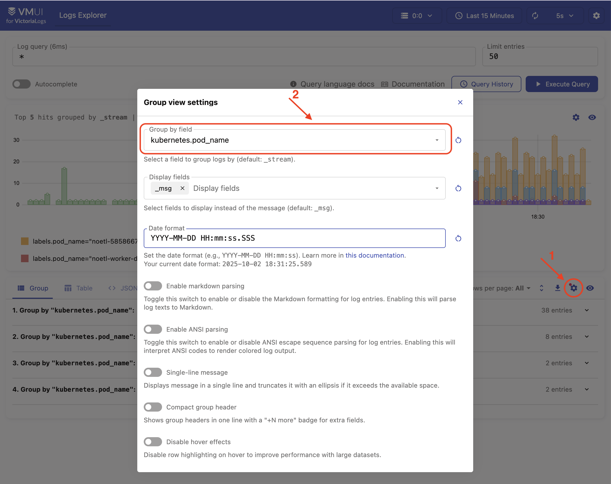

# NoETL Environment

[Taskfile](documents/taskfile.md) is used as task runner/build tool.  
The following tools are available for in-cluster troubleshooting: [Tshoot](manifests/tshoot/README.md)

## Available Components

After deployment, the following components are available on the host system:
- Noetl server: http://localhost:8082/
- VictoriaLogs: http://localhost:9428/select/vmui
- Grafana: http://localhost:3000
  - with login: `admin`; password: `admin`
- Postgres: **`localhost:54321`**
  - database: `demo_noetl`
  - user: `noetl`
  - password: `noetl`
  - JDBC URL: `jdbc:postgresql://localhost:54321/demo_noetl`

---
#### Requirements:
- docker  
- kind
- kubectl
- yq
- helm

Install **kind**, **kubectl**, **yq** on MacOS:
```
brew install kind
brew install kubectl
brew install yq
brew install helm
```  

## Spin up kind cluster

### 1. Create **noetl** kind cluster
```
task kind-create-cluster
```  
    
### 2. Deploy Postgres
```
task deploy-postgres
``` 
This command deploys Postgres 17.4 to the **noetl** cluster. 

The `pgdata` folder of the Postgres pod will be mounted to the `ci/kind/data` (excluded with `.gitignore`) folder on the host system. That way Postgres data is preserved even if all Docker volumes are pruned.  
The Postgres port will be exposed as `54321` on the host system. With this configuration, Postgres running in the **noetl** kind cluster will be available to applications on the host machine at `localhost:54321` with login `noetl` and password `noetl`. JDBC URL example: `jdbc:postgresql://localhost:54321/demo_noetl`

Note about ports you may see in kubectl vs. on the host:
- Inside the Kubernetes cluster, the service `postgres-ext` is a NodePort listening on `30321` (what can be seen in `kubectl get svc`).
- Kind maps that NodePort `30321` to host port `54321` via `extraPortMappings` in `ci/kind/config.yaml`:
  - containerPort: `30321` -> hostPort: `54321`
- As a result, you can connect to Postgres from:
  - In-cluster: NodePort is 30321 (and the ClusterIP service port is 5432).
  - From the host: connect to `localhost:54321` (e.g., `jdbc:postgresql://localhost:54321/demo_noetl`).

#### The mapping chain:
- Machine host (localhost:54321)   
    ↓ (Docker port mapping)  
- Kind Container (30321)   
    ↓ (Kubernetes NodePort service)  
- PostgreSQL Pod (5432)  (ClusterIP service)   

### 3. Build noetl
```
task docker-build-noetl
```
The image will be built with a temporary tag in the following format: YYYY-MM-DD-hh-mm.
This temporary tag will be saved in `.noetl_last_build_tag.txt.` This file contains the last temporary tag, which is later used for deployment.
>[!CAUTION]  
>By default, this command builds the Docker image without using cache.
>To enable cache, run the command with the `cache` argument:   
>`task docker-build-noetl -- cache`  
>or in short form:  
>`task dbn -- cache`  
>Combined commands such as `task bring-all` do not accept arguments and always perform the build without using cache.

### 4. Upload the built image to the **noetl** kind cluster
```
task load-noetl-image
```

### 5. (Optional) Check all images available in the **noetl** kind cluster with the following command
```
task show-kind-images
```

### 6. Deploy noetl
```
task deploy-noetl
```
The noetl service port `8082` is exposed as port `8082` on the host system. Container folders `/opt/noetl/data` and `/opt/noetl/logs` are mounted to the host folders `ci/kind/cache/noetl-data` and `ci/kind/cache/noetl-logs`,respectively. The container status can be checked at http://localhost:8082/api/health


## Install VictoriaMetrics stack

### 1. Add VictoriaMetrics Helm repository
```
task add-victoriametrics-helm-repo
```

### 2. Add Metrics Server Helm repository
```
task add-metrics-server-helm-repo
```

### 3. Add Vector Helm repository
```
task add-vector-helm-repo
```

### 4. (Optional) Check available Helm chart versions
```
helm search repo vm/victoria-metrics-k8s-stack -l
helm search repo vm/victoria-metrics-operator -l
helm search repo vm/victoria-logs-single -l
helm search repo metrics-server/metrics-server -l
helm search repo vector/vector -l
```
|         Deployment        | Version in use |
|:--------------------------|:--------------:|
| VictoriaMetrics stack    | 0.60.1         |
| VictoriaMetrics operator | 0.54.0         |
| VictoriaLogs             | 0.11.11        |
| Metrics Server            | 3.13.0         |
| Vector                    | 0.46.0         |
| |


### 5. Install Metrics Server
```
task deploy-metrics-server
```

### 6. Install VictoriaMetrics operator
To have control over an order of managed resources removal or to be able to remove a whole namespace with managed resources it’s recommended to disable operator in k8s-stack chart (victoria-metrics-operator.enabled: false) and install it separately. [Link to the official documentation](https://docs.victoriametrics.com/helm/victoria-metrics-k8s-stack/#install-operator-separately) 
```
task deploy-vmstack-operator
```

### 7. Install VictoriaMetrics stack
```
task deploy-vmstack
```
After deployment, Grafana is available at http://localhost:3000 with the login `admin` and password `admin`.  


### 8. Install VictoriaLogs
```
task deploy-vmlogs
```
The Victoria Logs service runs on port `9428`, which is exposed on the host system at the same port.   
The Web UI can be accessed at: http://localhost:9428/select/vmui  
Group view settings must be configured as follows:


### 9. Install Vector
```
task deploy-vector
```

### 10. Deploy exporter and VMServiceScrape for Postgres
```
task deploy-exporter
```

### 10. Deploy VMServiceScrape for noetl
```
task deploy-noetl-scrape
```

### 12. Deploy noetl and postgres Grafana dashboards
```
task deploy-dashboards
```

---

The following command performs all the above steps in a single run.
```
task deploy-monitoring
```

---  

Other available commands can be listed by running the `task` command without arguments:
```
task
```
For example, the following command performs these steps:
- Builds noetl image with a dynamic tag
- Creates a kind Kubernetes cluster
- Loads the built noetl image into the kind cluster
- Deploys monitoring components, including:
  - Metrics Server
  - VictoriaMetrics operator
  - VictoriaMetrics stack
  - VictoriaLogs
  - Vector
  - Postgres metrics exporter
  - Metrics scraping
  - Grafana dashboards
- Deploys Postgres
- Deploys the noetl API server and worker
```
task bring-all
```
