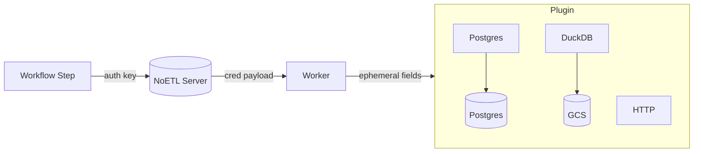

# Credentials, Aliases, and Secrets

This document defines the three credential-related concepts in the NoETL DSL and shows how they work together.

- auth: a single reference to a credential record (resolved by the Server).
- credentials: a map of aliases to credential records (used when a step needs several at once).
- secret: a value resolved from an external secret manager at render/exec time (used inside templates).

## auth (single credential)

```yaml
type: postgres
auth: pg_local
```

The worker retrieves the credential payload securely from the Server using the key `pg_local` and applies it to the plugin. The Postgres plugin uses these fields to build a connection (db_name, db_user, db_password, db_host, db_port, optional sslmode). You can provide explicit non-secret overrides in `with:` if needed (avoid placing secrets in `with`).

## credentials (multiple, alias-based)

Aliases are developer-chosen and become native handles in DuckDB SQL.

```yaml
type: duckdb
credentials:
  pg_db:      { key: pg_local }        # alias for ATTACH AS pg_db
  gcs_secret: { key: gcs_hmac_local }  # alias for CREATE SECRET gcs_secret
commands: |
  INSTALL postgres; LOAD postgres;
  -- Preferred: the plugin auto-creates a POSTGRES SECRET named 'pg_db'
  ATTACH '' AS pg_db (TYPE postgres, SECRET pg_db);

  CREATE OR REPLACE SECRET gcs_secret (
    TYPE gcs,
    KEY_ID  '{{ credentials.gcs_secret.key_id }}',
    SECRET  '{{ credentials.gcs_secret.secret_key }}',
    SCOPE   'gs://{{ workload.gcs_bucket }}'
  );
```

Notes:
- credentials.<alias>.secret is the DuckDB secret name (same as alias). The plugin creates the POSTGRES secret when possible; you can attach with `SECRET <alias>`.
- credentials.<alias>.connstr remains for backward compatibility.
- Secret alias names used in DuckDB are native and under your control (`CREATE SECRET <name>`), we only template values.

## secret (external secret manager)

Use inside templates, e.g. in HTTP headers.

```yaml
type: http
method: GET
endpoint: "https://api.example.com/data"
headers:
  Authorization: "Bearer {{ secret.api_service_token }}"
```

## Ephemeral Scope and Redaction

- Step-scoped: secret material is injected at runtime and not persisted in results.
- Redaction: values are redacted in logs and events; contributors should avoid logging secret values.

## Why this works

- No ambiguity: each keyword has a distinct role.
- Separation of concerns:
  - auth → lookup credential record (single)
  - credentials → bind multiple credentials via aliases
  - secret → resolve external secret value at runtime
- Native SQL: DuckDB aliases and secret names are unchanged and under your control.

## Resolution Flow


