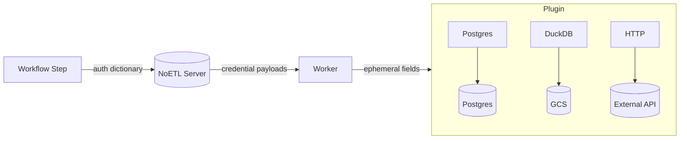

# Authentication and Credentials

This document defines the unified credential system in the NoETL DSL using a single `auth` dictionary approach.

The `auth` attribute is a dictionary that maps aliases to credential specifications, where each specification includes:
- `type`: The credential type (postgres, gcs, hmac, bearer, token, etc.)
- `key`: The credential key to resolve from the NoETL server
- `scope` (optional): For scoped credentials like GCS buckets

## Single Credential Usage

For steps requiring a single credential, use a single-alias dictionary:

```yaml
type: postgres
auth:
  pg: 
    type: postgres
    key: pg_local
```

The worker retrieves the credential payload securely from the Server using the key `pg_local` and applies it to the plugin. The Postgres plugin uses these fields to build a connection (db_name, db_user, db_password, db_host, db_port, optional sslmode).

## Multiple Credentials Usage

For steps requiring multiple credentials (like DuckDB connecting to various services), use multiple aliases in the auth dictionary:

```yaml
type: duckdb
auth:
  pg_db:
    type: postgres
    key: pg_local
  gcs_secret:
    type: gcs
    key: gcs_hmac_local
    scope: "gs://my-bucket"
  api_token:
    type: bearer
    key: api_service_token
commands: |
  INSTALL postgres; LOAD postgres;
  INSTALL httpfs;  LOAD httpfs;
  
  -- Use the postgres credential via alias 'pg_db'
  ATTACH '' AS pg_db (TYPE postgres, SECRET pg_db);

  -- Use the GCS credential via alias 'gcs_secret'
  CREATE OR REPLACE SECRET gcs_secret (
    TYPE gcs,
    KEY_ID  '{{ auth.gcs_secret.key_id }}',
    SECRET  '{{ auth.gcs_secret.secret_key }}',
    SCOPE   '{{ auth.gcs_secret.scope }}'
  );
```

## Template Access

All credential values are accessible in templates using the `auth.<alias>.*` pattern:

```yaml
type: http
method: GET
endpoint: "https://api.example.com/data"
auth:
  api_cred:
    type: bearer
    key: api_service_token
headers:
  Authorization: "Bearer {{ auth.api_cred.access_token }}"
```

## Credential Types

The system supports various credential types:

- `postgres`: Database connections (db_name, db_user, db_password, db_host, db_port, sslmode)
- `gcs`: Google Cloud Storage HMAC keys (key_id, secret_key)
- `s3`: AWS S3 credentials (access_key_id, secret_access_key, region)
- `bearer`: Bearer tokens for API authentication (access_token, token_expiry)
- `token`: Generic tokens (token, api_key)
- `hmac`: HMAC key pairs (key_id, secret_key)
- `oauth`: OAuth credentials (client_id, client_secret, refresh_token)

Each type exposes specific fields that can be accessed in templates via `{{ auth.<alias>.<field> }}`.

## Ephemeral Scope and Redaction

- Step-scoped: credential material is injected at runtime and not persisted in results.
- Redaction: values are redacted in logs and events; contributors should avoid logging credential values.

## Why this unified approach works

- **Consistency**: Single `auth` attribute for all credential scenarios
- **Flexibility**: Supports both simple string references and complex multi-credential scenarios
- **Type Safety**: Explicit `type` field provides clarity about credential format and usage
- **Aliasing**: Developer-controlled aliases for native SQL usage in DuckDB
- **Template Access**: All credential fields accessible via `{{ auth.<alias>.<field> }}`
- **Scoping**: Optional scoping for credentials like GCS buckets

## Resolution Flow


