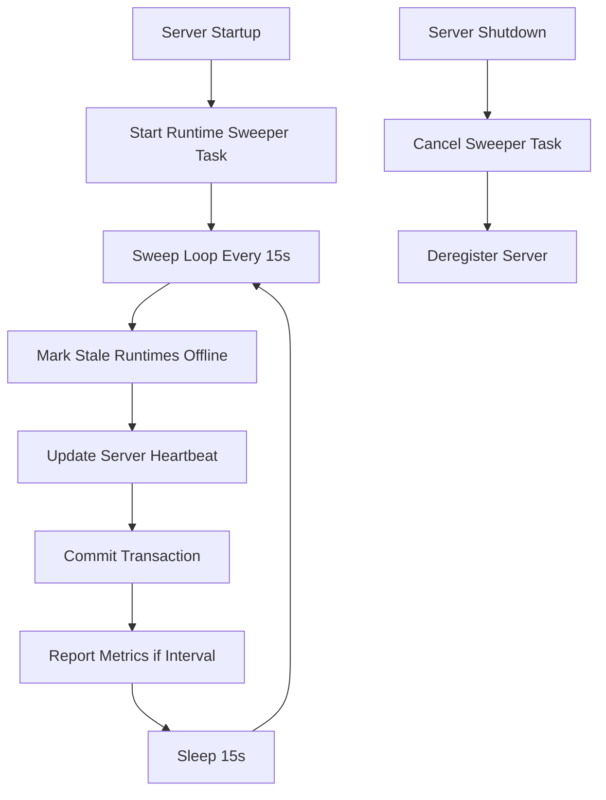
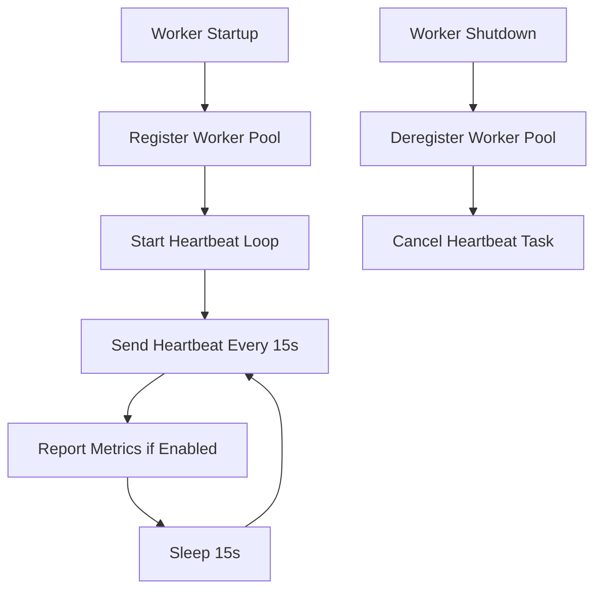
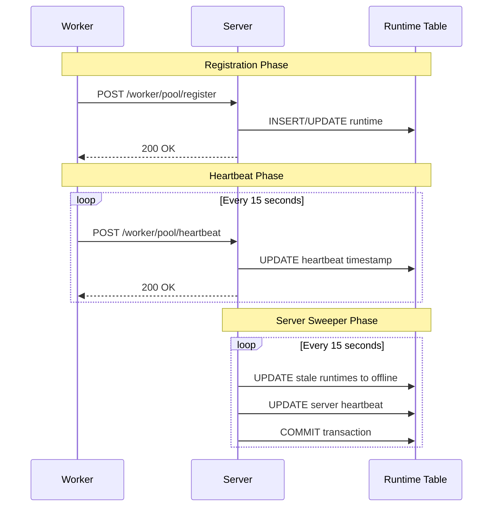
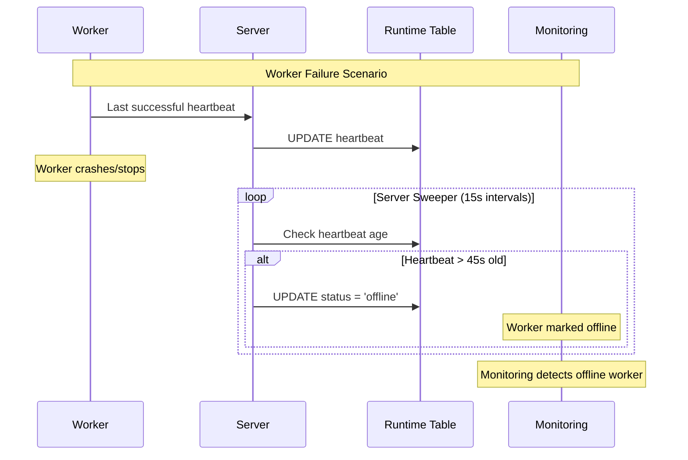
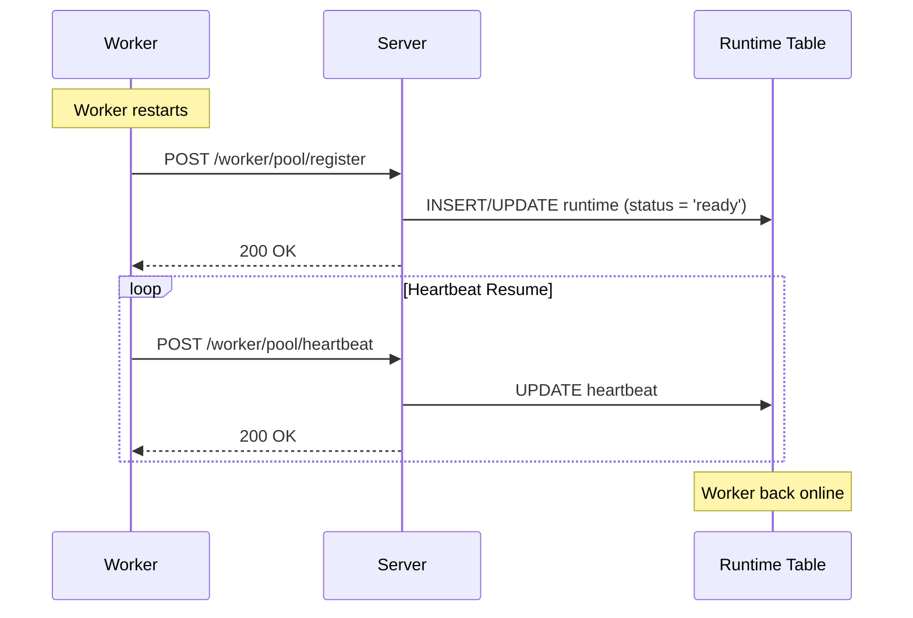

# NoETL Runtime Control Loop Architecture

## Overview

The NoETL runtime control loop is a distributed system for monitoring and managing the health of server and worker components. It provides automated heartbeat monitoring, status tracking, and runtime metrics collection across the entire NoETL infrastructure.

## Core Components

### 1. Runtime Table (`noetl.runtime`)

The central database table that tracks all runtime components:

```sql
CREATE TABLE noetl.runtime (
    runtime_id BIGINT PRIMARY KEY,
    name TEXT NOT NULL,
    kind TEXT NOT NULL CHECK (kind IN ('worker_pool','server_api','broker')),
    uri TEXT,  -- Resource URI (endpoint for servers, resource location for workers)
    status TEXT NOT NULL,
    labels JSONB,
    capabilities JSONB,
    capacity INTEGER,
    runtime JSONB,
    heartbeat TIMESTAMPTZ NOT NULL DEFAULT now(),
    created_at TIMESTAMPTZ NOT NULL DEFAULT now(),
    updated_at TIMESTAMPTZ NOT NULL DEFAULT now()
);
```

**Key Fields:**
- `runtime_id`: Unique identifier (Snowflake ID)
- `name`: Component identifier (e.g., "server-local", "worker-cpu")
- `kind`: Component type (`worker_pool`, `server_api`, `broker`)
- `status`: Current status (`ready`, `offline`, etc.)
- `heartbeat`: Last heartbeat timestamp
- `runtime`: JSONB metadata (PID, hostname, type)

**Indexes:**
- `idx_runtime_kind_name`: Unique constraint on (kind, name)
- `idx_runtime_status`: Performance index for status queries
- `idx_runtime_runtime_type`: Index on runtime metadata type

### 2. Server Runtime Sweeper

**Location:** `noetl/server/app.py:_runtime_sweeper()`

The server-side background task that maintains runtime health monitoring.

#### Algorithm Flow:



#### Implementation Details:

**Module:** `noetl.server.app`
**Method:** `_runtime_sweeper()`
**Trigger:** FastAPI lifespan startup
**Interval:** 15 seconds (configurable via `NOETL_SERVER_SWEEP_INTERVAL`)

**Step 1: Mark Stale Runtimes Offline**
```python
# Module: noetl.server.app._runtime_sweeper()
# API: Direct database query
# Table: noetl.runtime (UPDATE)

await cur.execute("""
    UPDATE runtime SET status = 'offline', updated_at = now()
    WHERE status != 'offline' AND heartbeat < (now() - make_interval(secs => %s))
""", (offline_after,))
```

**Configuration:**
- `NOETL_SERVER_OFFLINE_AFTER`: Seconds before marking offline (default: 45)

**Step 2: Update Server Heartbeat**
```python
# Module: noetl.server.app._runtime_sweeper()
# API: Direct database query
# Table: noetl.runtime (UPDATE)

await cur.execute("""
    UPDATE runtime 
    SET heartbeat = now(), updated_at = now(), status = 'ready'
    WHERE kind = 'server_api' AND name = %s
""", (server_name,))
```

**Auto-recreation Logic:**
If no rows affected and `NOETL_AUTO_RECREATE_RUNTIME=true`:
```python
# Module: noetl.server.app._runtime_sweeper()
# API: Direct database query
# Table: noetl.runtime (INSERT)

await cur.execute("""
    INSERT INTO runtime (runtime_id, name, kind, uri, status, labels, capacity, runtime, heartbeat, created_at, updated_at)
    VALUES (%s, %s, 'server_api', %s, 'ready', NULL, NULL, %s::jsonb, now(), now(), now())
    ON CONFLICT (kind, name)
    DO UPDATE SET
        uri = EXCLUDED.uri,
        status = EXCLUDED.status,
        runtime = EXCLUDED.runtime,
        heartbeat = now(),
        updated_at = now()
""", (runtime_id, server_name, server_url, runtime_payload))
```

**Step 3: Transaction Commit**
```python
# Module: noetl.server.app._runtime_sweeper()
# API: Database connection commit
# Error Handling: Explicit logging (no silent failures)

await conn.commit()
logger.info("Runtime sweeper transaction committed successfully")
```

**Step 4: Metrics Reporting** (Optional)
```python
# Module: noetl.server.app._report_server_metrics()
# API: POST /metrics/report
# Interval: 60 seconds (configurable via NOETL_SERVER_METRICS_INTERVAL)

await _report_server_metrics(server_name)
```

### 3. Worker Registration & Heartbeat

**Location:** `noetl/worker/worker.py`

Workers register themselves and maintain heartbeat communication with the server.

#### Algorithm Flow:



#### Registration Process:

**Module:** `noetl.worker.worker.register_worker_pool_from_env()`
**API:** `POST /api/worker/pool/register`
**Table:** `noetl.runtime` (INSERT/UPDATE via upsert)

**Payload Structure:**
```python
payload = {
    "name": name,                    # worker-cpu, worker-gpu, etc.
    "runtime": runtime,              # cpu, gpu, etc.
    "uri": worker_uri,              # k8s://namespace/pod or local://hostname
    "status": "ready",
    "capacity": capacity,            # Optional worker capacity
    "labels": labels,               # Optional labels array
    "pid": os.getpid(),
    "hostname": hostname,
}
```

**Server Handler:** `noetl.api.routers.runtime.register_worker_pool()`
**Database Operation:**
```python
# Module: noetl.api.routers.runtime._upsert_worker_pool()
# Table: noetl.runtime (INSERT with ON CONFLICT)

INSERT INTO runtime (runtime_id, name, kind, uri, status, labels, capacity, runtime, heartbeat, created_at, updated_at)
VALUES (%s, %s, 'worker_pool', %s, %s, %s::jsonb, %s, %s::jsonb, now(), now(), now())
ON CONFLICT (kind, name)
DO UPDATE SET
    uri = EXCLUDED.uri,
    status = EXCLUDED.status,
    labels = EXCLUDED.labels,
    capacity = EXCLUDED.capacity,
    runtime = EXCLUDED.runtime,
    heartbeat = now(),
    updated_at = now()
```

#### Heartbeat Process:

**Module:** `noetl.worker.worker.ScalableQueueWorkerPool._heartbeat_loop()`
**API:** `POST /api/worker/pool/heartbeat`
**Table:** `noetl.runtime` (UPDATE)
**Interval:** 15 seconds (configurable via `NOETL_WORKER_HEARTBEAT_INTERVAL`)

**Heartbeat Payload:**
```python
payload = {"name": worker_name}
```

**Server Handler:** `noetl.api.routers.runtime.heartbeat_worker_pool()`
**Database Operation:**
```python
# Module: noetl.api.routers.runtime.heartbeat_worker_pool()
# Table: noetl.runtime (UPDATE)

UPDATE runtime
SET heartbeat = now(), updated_at = now()
WHERE kind = 'worker_pool' AND name = %s
```

**Auto-recreation Logic:**
If worker not found, attempt to recreate from heartbeat payload (if sufficient data):
```python
# Module: noetl.api.routers.runtime.heartbeat_worker_pool()
# Fallback: Auto-recreate worker registration

result = await _upsert_worker_pool(recreate_payload, require_full_payload=False)
```

### 4. Server Registration

**Location:** `noetl/worker/worker.py:register_server_from_env()`

Servers register themselves at startup for monitoring by other components.

**Module:** `noetl.worker.worker.register_server_from_env()`
**API:** `POST /api/runtime/register`
**Table:** `noetl.runtime` (INSERT/UPDATE via upsert)

**Payload Structure:**
```python
payload = {
    "name": server_name,             # server-local, server-k8s, etc.
    "component_type": "server_api",
    "runtime": "server",
    "base_url": server_url,          # http://localhost:8083
    "status": "ready",
    "capacity": None,
    "labels": labels,
    "pid": os.getpid(),
    "hostname": hostname,
}
```

**Server Handler:** `noetl.api.routers.runtime.register_runtime_component()`

## Control Loop Interactions

### 1. Normal Operation Flow



### 2. Failure Detection Flow



### 3. Recovery Flow



## Configuration Parameters

### Server Configuration

| Environment Variable | Default | Description |
|---------------------|---------|-------------|
| `NOETL_SERVER_SWEEP_INTERVAL` | 15 | Sweeper loop interval (seconds) |
| `NOETL_SERVER_OFFLINE_AFTER` | 45 | Seconds before marking offline |
| `NOETL_AUTO_RECREATE_RUNTIME` | true | Auto-recreate missing runtime entries |
| `NOETL_SERVER_METRICS_INTERVAL` | 60 | Metrics reporting interval (seconds) |
| `NOETL_SERVER_NAME` | server-{hostname} | Server identifier |

### Worker Configuration

| Environment Variable | Default | Description |
|---------------------|---------|-------------|
| `NOETL_WORKER_HEARTBEAT_INTERVAL` | 15 | Heartbeat interval (seconds) |
| `NOETL_WORKER_POOL_NAME` | worker-{runtime} | Worker pool identifier |
| `NOETL_WORKER_POOL_RUNTIME` | cpu | Worker runtime type |
| `NOETL_WORKER_CAPACITY` | None | Worker capacity limit |
| `NOETL_WORKER_LABELS` | None | Comma-separated labels |

## API Endpoints

### Runtime Management

| Endpoint | Method | Purpose | Module |
|----------|--------|---------|---------|
| `/api/worker/pool/register` | POST | Register worker pool | `noetl.api.routers.runtime` |
| `/api/worker/pool/heartbeat` | POST | Worker heartbeat | `noetl.api.routers.runtime` |
| `/api/worker/pool/deregister` | DELETE | Deregister worker | `noetl.api.routers.runtime` |
| `/api/runtime/register` | POST | Register server/broker | `noetl.api.routers.runtime` |
| `/api/runtime/deregister` | DELETE | Deregister component | `noetl.api.routers.runtime` |
| `/api/worker/pools` | GET | List worker pools | `noetl.api.routers.runtime` |

### Metrics Endpoints

| Endpoint | Method | Purpose | Module |
|----------|--------|---------|---------|
| `/api/metrics/report` | POST | Report metrics | `noetl.api.routers.metrics` |
| `/api/metrics/query` | GET | Query metrics | `noetl.api.routers.metrics` |

## Database Operations

### Core Queries

**1. Mark Stale Runtimes Offline**
```sql
-- Module: noetl.server.app._runtime_sweeper()
-- Frequency: Every 15 seconds
UPDATE runtime 
SET status = 'offline', updated_at = now()
WHERE status != 'offline' 
  AND heartbeat < (now() - make_interval(secs => %s))
```

**2. Update Server Heartbeat**
```sql
-- Module: noetl.server.app._runtime_sweeper()
-- Frequency: Every 15 seconds
UPDATE runtime 
SET heartbeat = now(), updated_at = now(), status = 'ready'
WHERE kind = 'server_api' AND name = %s
```

**3. Update Worker Heartbeat**
```sql
-- Module: noetl.api.routers.runtime.heartbeat_worker_pool()
-- Frequency: Every 15 seconds (per worker)
UPDATE runtime
SET heartbeat = now(), updated_at = now()
WHERE kind = 'worker_pool' AND name = %s
```

**4. Runtime Status Query**
```sql
-- Module: Various monitoring/status endpoints
-- Usage: Real-time status checks
SELECT kind, name, status, heartbeat, 
       EXTRACT(EPOCH FROM AGE(NOW(), heartbeat)) as seconds_since_heartbeat
FROM runtime 
ORDER BY kind, name
```

## Error Handling & Resilience

### 1. Silent Failure Prevention

All database operations include explicit error handling:

```python
try:
    await conn.commit()
    logger.info("Runtime sweeper transaction committed successfully")
except Exception as e:
    logger.error(f"Runtime sweeper commit failed: {e}")
    logger.exception("Commit failure details:")
```

### 2. Heartbeat Failure Tolerance

Workers continue operating even with heartbeat failures:
- Up to 5 consecutive failures logged as warnings
- After 5 failures, reset counter to prevent log spam
- Worker continues task execution regardless of heartbeat status

### 3. Auto-Recovery Mechanisms

**Server Auto-Recreation:**
- If server heartbeat update affects 0 rows
- Automatically recreate runtime entry
- Ensures server presence in monitoring

**Worker Auto-Recreation:**
- If worker heartbeat fails (404/unknown)
- Attempt recreation from heartbeat payload
- Fallback to full re-registration

### 4. Database Connection Handling

- All operations use async connection pooling
- Transactions explicitly committed/rolled back
- Connection cleanup in finally blocks
- Retry logic for transient failures

## Monitoring & Observability

### 1. Log Levels

**INFO Level:**
- Successful heartbeat updates
- Runtime component registration/deregistration
- Transaction commits

**ERROR Level:**
- Database operation failures
- Heartbeat communication failures
- Transaction commit failures

**DEBUG Level:**
- Detailed operation timing
- Payload contents (sanitized)
- Metrics reporting status

### 2. Metrics Collection

**Server Metrics:**
- Active worker count
- Queue size
- Heartbeat success rate
- Sweeper loop timing

**Worker Metrics:**
- Task execution count
- Task success/failure rates
- Heartbeat latency
- Resource utilization

### 3. Health Checks

**Runtime Status Endpoint:**
```bash
curl -s "http://localhost:8083/api/postgres/execute" \
  -H "Content-Type: application/json" \
  -d '{"query": "SELECT kind, name, status FROM noetl.runtime ORDER BY kind, name"}'
```

**Expected Response:**
```json
{
  "status": "ok",
  "result": [
    ["server_api", "server-local", "ready"],
    ["worker_pool", "worker-cpu", "ready"]
  ]
}
```

## Troubleshooting Guide

### 1. Server Shows Offline

**Symptoms:**
- Server runtime status = 'offline'
- Recent heartbeat timestamp

**Root Causes:**
- Runtime sweeper not running
- Database commit failures
- Transaction rollback issues

**Investigation:**
```bash
# Check server logs for sweeper activity
grep -i "runtime sweeper\|commit" logs/server-debug.log

# Check database status directly
curl -s "http://localhost:8083/api/postgres/execute" \
  -d '{"query": "SELECT name, status, heartbeat FROM noetl.runtime WHERE kind = '\''server_api'\''"}'
```

### 2. Worker Shows Offline

**Symptoms:**
- Worker runtime status = 'offline'
- Stale heartbeat timestamp

**Root Causes:**
- Worker process crashed
- Network connectivity issues
- Server API unavailable

**Investigation:**
```bash
# Check worker logs
grep -i "heartbeat" logs/worker-debug.log

# Check worker process status
ps aux | grep worker

# Test direct API connectivity
curl -s "http://localhost:8083/api/worker/pool/heartbeat" \
  -d '{"name": "worker-cpu"}'
```

### 3. Runtime Sweeper Not Working

**Symptoms:**
- No sweeper log messages
- All components show offline
- Stale heartbeat timestamps

**Investigation:**
```bash
# Check if sweeper task started
grep -i "Starting runtime sweeper" logs/server-debug.log

# Check for sweeper errors
grep -i "sweeper.*error\|sweeper.*failed" logs/server-debug.log

# Verify database connectivity
curl -s "http://localhost:8083/health"
```

### 4. Database Connection Issues

**Symptoms:**
- Connection timeouts
- Commit failures
- Silent transaction rollbacks

**Investigation:**
```bash
# Check database logs
docker logs noetl-postgres

# Test database connectivity
psql -h localhost -p 5432 -U noetl -d noetl -c "SELECT NOW()"

# Check connection pool status
grep -i "connection\|pool" logs/server-debug.log
```

## Performance Considerations

### 1. Database Load

- Runtime sweeper queries run every 15 seconds
- Worker heartbeats scale with worker count
- Indexes optimize status and heartbeat queries
- Batch operations minimize transaction overhead

### 2. Network Traffic

- Minimal heartbeat payloads (name only)
- HTTP keepalive for persistent connections
- Timeout settings prevent hanging requests
- Async I/O for non-blocking operations

### 3. Memory Usage

- Connection pooling reduces overhead
- Async tasks use minimal memory
- Log rotation prevents disk filling
- Metrics collection is optional

### 4. Scaling Characteristics

- Runtime table scales to thousands of components
- Heartbeat frequency configurable per environment
- Server sweeper handles large runtime tables
- Worker pools distribute load effectively

## Security Considerations

### 1. Database Access

- Runtime operations use dedicated noetl user
- Minimal required privileges (SELECT, INSERT, UPDATE)
- No DELETE operations in normal flow
- Prepared statements prevent SQL injection

### 2. API Security

- Runtime endpoints require valid JSON payloads
- Input validation on all parameters
- Rate limiting recommended for production
- HTTPS recommended for external access

### 3. Process Isolation

- Workers run in separate processes
- Server and workers can run on different hosts
- Database connections isolated per component
- No shared state between components
