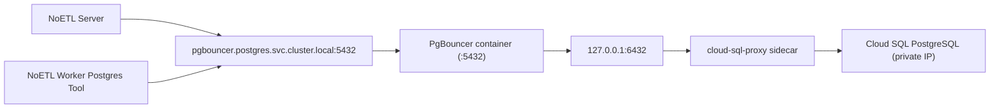

In the current GCP setup, both are used:

- `pgbouncer` as the in-cluster PostgreSQL endpoint for NoETL and playbooks
- `cloud-sql-proxy` as a sidecar inside the PgBouncer pod

`private-ip` is currently **hardcoded in automation code**, not provided as an environment variable.

## Where private IP is hardcoded

In the deployment step that renders the PgBouncer Deployment manifest:

- File: `automation/gcp_gke/noetl_gke_fresh_stack.yaml`
- Step: `deploy_pgbouncer`
- Proxy args include a literal:
  - `--private-ip`

This means proxy-to-Cloud-SQL uses private address routing whenever that pod is created.

## What is configurable vs hardcoded

### Configurable via workload variables

In `automation/gcp_gke/noetl_gke_fresh_stack.yaml`:

- `cloud_sql_enable_private_ip` (default `true`)
- `cloud_sql_enable_public_ip` (default `false`)
- `pgbouncer_enabled` (default `true`)
- `postgres_host` (default `pgbouncer.postgres.svc.cluster.local`)
- `cloud_sql_proxy_port` (default `6432`)

These values control:

- Cloud SQL instance network mode at provisioning/patch time
- Whether PgBouncer is deployed
- Which endpoint NoETL points to

### Hardcoded in playbook code path

- Proxy argument `--private-ip` is static in the generated manifest for `cloud-sql-proxy`.
- There is no current workload/env toggle that removes or replaces this flag dynamically.

## End-to-end communication path



## How NoETL server/worker are wired to PgBouncer

### NoETL server

- Deployment passes:
  - `config.server.POSTGRES_HOST=$DB_HOST`
  - `config.server.POSTGRES_PORT=$DB_PORT`
- In Cloud SQL mode, `DB_HOST` is `workload.postgres_host` (PgBouncer service).
- Server reads `POSTGRES_HOST` / `POSTGRES_PORT` and builds DB connection string in code.

### Worker PostgreSQL tool steps

- Playbooks typically use `auth: "{{ db_credential }}"`.
- During bootstrap, credential `pg_auth` is registered with host=`$DB_HOST`.
- In Cloud SQL mode that host is also PgBouncer service.
- Worker postgres executor connects to credential host/port (direct connection or optional worker-side pool).

## Why this design is used

- PgBouncer reduces connection churn from many short-lived worker queries.
- Cloud SQL Proxy handles IAM-authenticated connectivity to Cloud SQL.
- Keeping PgBouncer + proxy in one pod allows backend host `127.0.0.1:<proxy_port>`, isolating Cloud SQL endpoint from app pods.

## Operational checks

### Confirm proxy args in deployed pod

```bash
kubectl -n postgres get deploy pgbouncer -o yaml | rg -n -- '--private-ip|cloud-sql-proxy|--port='
```

### Confirm NoETL is pointing to PgBouncer

```bash
kubectl -n noetl get configmap noetl-server-config -o jsonpath='{.data.POSTGRES_HOST}{"\n"}{.data.POSTGRES_PORT}{"\n"}'
```

Expected:

- `pgbouncer.postgres.svc.cluster.local`
- `5432`

### Confirm auth playbooks use the same DB endpoint

```bash
kubectl -n noetl port-forward svc/noetl 18082:8082
curl -s http://localhost:18082/api/credentials | jq '.[] | select(.name=="pg_auth") | .data'
```

## If you need public-IP proxy mode

Today, changing Cloud SQL instance flags alone is not enough for proxy behavior because proxy args still include hardcoded `--private-ip`.

To support both modes cleanly, update `deploy_pgbouncer` so proxy args are conditional:

- include `--private-ip` only when `cloud_sql_enable_private_ip=true`
- omit it (or add explicit public behavior) when private mode is disabled

## Related docs

- [Current GCP Setup and System Playbook Architecture](./gcp-current-setup-system-playbooks)
- [GKE Deployment Guide](./gke-deployment)
