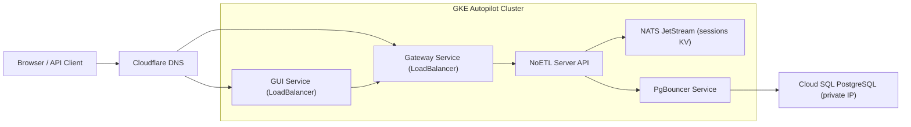
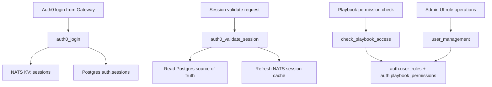

## Scope and intent

This document captures the **current GCP deployment profile** in this repository and the **system playbooks** used for authentication and authorization.

It is based on:

- `automation/gcp_gke/noetl_gke_fresh_stack.yaml`
- `automation/gcp_gke/README.md`
- `tests/fixtures/playbooks/api_integration/auth0/*.yaml`

Current baseline date: **2026-02-19**.

## Current GCP deployment profile

The active baseline is a GKE Autopilot deployment with Cloud SQL + PgBouncer, where only Gateway and GUI are public.

### Baseline topology



### How this profile is applied

Use `automation/gcp_gke/noetl_gke_fresh_stack.yaml` with:

- `use_cloud_sql=true`
- `cloud_sql_enable_private_ip=true`
- `cloud_sql_enable_public_ip=false`
- `pgbouncer_enabled=true`
- `deploy_postgres=false`
- `deploy_ingress=false`
- `gateway_service_type=LoadBalancer`
- `gui_service_type=LoadBalancer`

Example (existing-cluster deploy):

```bash
noetl run automation/gcp_gke/noetl_gke_fresh_stack.yaml \
  --set action=deploy \
  --set project_id=<gcp-project-id> \
  --set cluster_name=noetl-cluster \
  --set build_images=false \
  --set use_cloud_sql=true \
  --set cloud_sql_enable_private_ip=true \
  --set cloud_sql_enable_public_ip=false \
  --set pgbouncer_enabled=true \
  --set deploy_postgres=false \
  --set deploy_clickhouse=false \
  --set deploy_ingress=false \
  --set gateway_service_type=LoadBalancer \
  --set gui_service_type=LoadBalancer
```

## Auth bootstrap on GCP deploy

When `bootstrap_gateway_auth=true` (default), deploy automation performs:

1. Port-forward to NoETL API (`svc/noetl`)
2. Register credentials:
   - `pg_auth`
   - `nats_credential`
3. Register playbooks:
   - `api_integration/auth0/auth0_login`
   - `api_integration/auth0/auth0_validate_session`
   - `api_integration/auth0/check_playbook_access`
   - `api_integration/auth0/user_management`
   - `api_integration/auth0/provision_auth_schema`
   - `api_integration/auth0/setup_admin_permissions`
4. Execute `api_integration/auth0/provision_auth_schema` and wait until `COMPLETED`

## System playbook architecture

### High-level flow



### Playbook responsibilities

| Playbook path | Purpose | Main dependencies | Typical output |
|---|---|---|---|
| `api_integration/auth0/provision_auth_schema` | Create `auth` schema/tables, seed roles/permissions | Postgres (`pg_auth`) | Schema + default RBAC data ready |
| `api_integration/auth0/setup_admin_permissions` | Seed wildcard playbook permissions, assign bootstrap admin roles | Postgres (`pg_auth`) | Admin/developer grants in `auth.playbook_permissions` and `auth.user_roles` |
| `api_integration/auth0/auth0_login` | Decode Auth0 JWT, upsert user/session, load roles, cache session | Postgres + NATS + Gateway callback | `session_token`, user identity, role list |
| `api_integration/auth0/auth0_validate_session` | Validate token against Postgres, refresh NATS cache | Postgres + NATS + Gateway callback | `valid=true/false` + user/session metadata |
| `api_integration/auth0/check_playbook_access` | Evaluate RBAC for requested playbook/action | Postgres + Gateway callback | `allowed=true/false` |
| `api_integration/auth0/user_management` | Admin operations for users/roles | Postgres + async callback | users list, roles list, role update result |

### Callback contracts used by Gateway

- Synchronous callback route: `POST /api/internal/callback`
  - Used by `auth0_login`, `auth0_validate_session`, `check_playbook_access`
- Async callback route: `POST /api/internal/callback/async`
  - Used by `user_management`
- Correlation field: `request_id`

Without `request_id`, most playbooks complete without callback and return local execution results only.

## Auth0 RBAC model for developers

### Core tables

- `auth.users`
- `auth.sessions`
- `auth.roles`
- `auth.permissions`
- `auth.user_roles`
- `auth.role_permissions`
- `auth.playbook_permissions`
- `auth.audit_log`

### Default roles seeded

- `admin`
- `developer`
- `analyst`
- `viewer`

### Path permission semantics (`check_playbook_access`)

A request is allowed when all are true:

1. Session token maps to active, non-expired session and active user
2. User has at least one active role
3. Role has a matching playbook permission where:
   - exact path matches, or `allow_pattern` matches
   - `deny_pattern` does not match
   - requested action flag is true (`can_execute`, `can_view`, `can_modify`)

## Developer runbook

### 1. Deploy or refresh stack

```bash
noetl run automation/gcp_gke/noetl_gke_fresh_stack.yaml \
  --set action=deploy \
  --set project_id=<gcp-project-id> \
  --set cluster_name=<cluster-name>
```

### 2. Validate auth playbooks are registered

```bash
kubectl port-forward -n noetl svc/noetl 18082:8082

curl -s http://localhost:18082/api/catalog | jq '.resources[] | select(.path | startswith("api_integration/auth0/")) | .path'
```

### 3. Validate schema/role data

```bash
kubectl exec -n postgres deploy/pgbouncer -- sh -lc 'echo "Use Cloud SQL client path for deep DB checks"'

# From any SQL client against the same DB used by pg_auth:
# SELECT role_name FROM auth.roles ORDER BY role_name;
# SELECT user_id, role_id FROM auth.user_roles ORDER BY user_id, role_id;
# SELECT role_id, allow_pattern, deny_pattern, can_execute, can_view, can_modify
# FROM auth.playbook_permissions ORDER BY role_id;
```

### 4. Verify session cache path

- Login through Gateway UI/API
- Confirm `auth.sessions` row exists in Postgres
- Confirm `sessions` bucket entry exists in NATS KV

## Common pitfalls and fixes

### 1. DNS or host resolution errors for `pg_auth`

Symptom in execution events: `"[Errno -2] Name or service not known"`

Fix:

- Verify `pg_auth.data.db_host` matches reachable in-cluster service (`pgbouncer.postgres.svc.cluster.local` in Cloud SQL profile)
- Validate DNS from NoETL worker namespace
- Re-register credential if host/port changed

### 2. No callback received by Gateway

Fix:

- Ensure `request_id` is passed by caller
- Ensure `gateway_url` is reachable from worker (`http://gateway.gateway.svc.cluster.local` in-cluster)
- Verify callback route (`/api/internal/callback` vs `/api/internal/callback/async`)

### 3. `user_management` role updates fail on `granted_by`

`user_management.yaml` writes `auth.user_roles.granted_by`.
If the active schema was created only by the current lightweight `provision_auth_schema.yaml`, this column may be missing.

Remediation options:

1. Add column via migration:

```sql
ALTER TABLE auth.user_roles
ADD COLUMN IF NOT EXISTS granted_by BIGINT REFERENCES auth.users(user_id);
```

2. Or align `user_management.yaml` insert statement to current table definition.

## Related docs

- [Cloud SQL + PgBouncer (Private IP)](./gcp-cloudsql-pgbouncer-private-ip)
- [GKE Deployment Guide](./gke-deployment)
- [Gateway Auth0 Setup](../gateway/auth0-setup)
- [Gateway Deployment Guide](../gateway/deployment-guide)
- [IAP GKE Quick Start](../iap-gcp/gke_quick_start)
