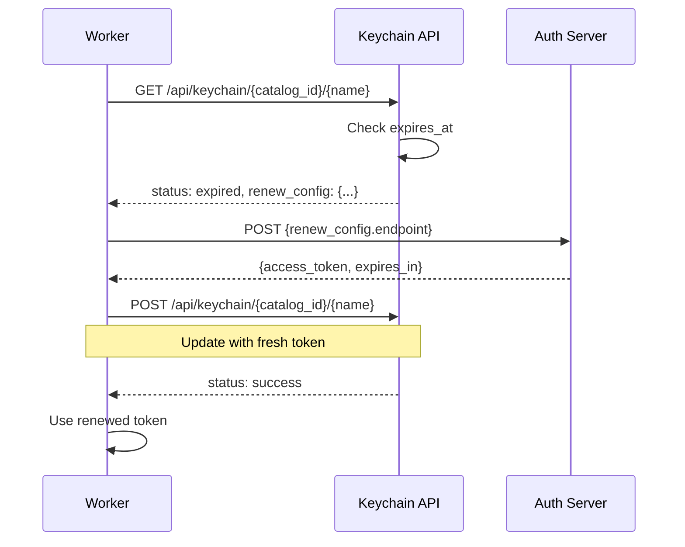

# Authentication and Keychain Reference

This document provides comprehensive reference documentation for NoETL's authentication and keychain systems.

## Table of Contents

- [Overview](#overview)
- [Auth Attribute](#auth-attribute)
- [Keychain System](#keychain-system)
- [Scope Types](#scope-types)
- [Expiration and Auto-Renewal](#expiration-and-auto-renewal)
- [API Reference](#api-reference)
- [Playbook Examples](#playbook-examples)

---

## Overview

NoETL provides two complementary systems for authentication and credential management:

1. **Auth Attribute** - References to stored credentials used in tool executions
2. **Keychain System** - Dynamic token caching with automatic renewal and scope-based access control

### Key Concepts

- **Auth Reference**: A named reference (e.g., `pg_local`, `gcp_auth`) that points to stored credentials
- **Credential**: Static authentication data stored in `noetl.credential` table (username/password, API keys, service accounts)
- **Keychain Entry**: Dynamic, time-limited tokens stored in `noetl.keychain` table with automatic renewal capabilities
- **Scope**: Access control level determining which executions can access a keychain entry

---

## Auth Attribute

The `auth` attribute is used in playbook steps to reference stored credentials. It is NOT the credential itself, but a reference name/profile.

### Naming Convention

Use names that clearly indicate they are references, not actual credentials:

**Good Examples:**
- `pg_auth` - PostgreSQL auth reference
- `gcp_auth` - Google Cloud Platform auth reference  
- `aws_auth` - AWS auth reference
- `snowflake_auth` - Snowflake auth reference

**Avoid:**
- `oauth_cred` - Misleading (sounds like the credential itself)
- `postgres_password` - Sounds like the actual password
- `api_key` - Sounds like the actual key

### Usage in Playbooks

#### V2 DSL Format

```yaml
workload:
  pg_auth: pg_local
  gcp_auth: google_oauth
  
workflow:
- step: query_database
  tool:
    kind: postgres
    auth: "{{ workload.pg_auth }}"
    command: SELECT * FROM users
    
- step: fetch_secret
  tool:
    kind: http
    auth: "{{ workload.gcp_auth }}"
    endpoint: https://secretmanager.googleapis.com/v1/...
```

### Credential Storage

Credentials are stored in the `noetl.credential` table:

```sql
CREATE TABLE noetl.credential (
    credential_id BIGSERIAL PRIMARY KEY,
    credential_key VARCHAR(255) UNIQUE NOT NULL,
    credential_type VARCHAR(50) NOT NULL,
    data JSONB NOT NULL,
    created_at TIMESTAMP DEFAULT NOW(),
    updated_at TIMESTAMP DEFAULT NOW()
);
```

**Credential Types:**
- `postgres` - Database credentials (host, port, user, password, database)
- `oauth2` - OAuth2 credentials (client_id, client_secret, token_url)
- `bearer` - Bearer token authentication
- `basic` - HTTP basic auth (username, password)
- `api_key` - API key authentication
- `service_account` - Service account JSON (GCP, AWS)
- `snowflake` - Snowflake credentials (account, user, password, warehouse, database)

### Credential Resolution

When a tool uses `auth: "{{ workload.pg_auth }}"`, the worker:

1. Extracts the auth reference name (`pg_local`)
2. Calls credential API: `GET /api/credential/{credential_key}`
3. Receives decrypted credential data
4. Uses credentials to connect to the target service

---

## Keychain System

The keychain system provides dynamic token caching with scope-based access control and automatic renewal. It is designed for:

- OAuth tokens that expire and need renewal
- Session tokens from authentication APIs
- Temporary credentials that should be shared across steps
- Cached API responses that don't change frequently

### Keychain Table Schema

```sql
CREATE TABLE noetl.keychain (
    keychain_id BIGSERIAL PRIMARY KEY,
    cache_key VARCHAR(512) UNIQUE NOT NULL,
    keychain_name VARCHAR(255) NOT NULL,
    catalog_id BIGINT,
    execution_id BIGINT,
    parent_execution_id BIGINT,
    data BYTEA NOT NULL,
    credential_type VARCHAR(50),
    cache_type VARCHAR(50) DEFAULT 'token',
    scope_type VARCHAR(50) DEFAULT 'global',
    expires_at TIMESTAMP,
    created_at TIMESTAMP DEFAULT NOW(),
    updated_at TIMESTAMP DEFAULT NOW(),
    accessed_at TIMESTAMP DEFAULT NOW(),
    access_count INTEGER DEFAULT 0,
    auto_renew BOOLEAN DEFAULT FALSE,
    renew_config BYTEA,
    CONSTRAINT fk_catalog FOREIGN KEY (catalog_id) 
        REFERENCES noetl.catalog(catalog_id) ON DELETE CASCADE,
    INDEX idx_keychain_catalog (catalog_id),
    INDEX idx_keychain_execution (execution_id),
    INDEX idx_keychain_name (keychain_name),
    INDEX idx_keychain_expires (expires_at)
);
```

### Keychain Playbook Section

Define keychain entries in the `keychain:` section of your playbook:

```yaml
keychain:
  - name: openai_token
    kind: secret_manager
    provider: gcp
    scope: global
    auth: "{{ workload.gcp_auth }}"
    map:
      api_key: '{{ workload.openai_secret_path }}'

  - name: amadeus_credentials
    kind: secret_manager
    provider: gcp
    scope: catalog
    auth: "{{ workload.gcp_auth }}"
    map:
      client_id: '{{ workload.amadeus_key_path }}'
      client_secret: '{{ workload.amadeus_secret_path }}'

  - name: amadeus_token
    kind: oauth2
    scope: global
    auto_renew: true
    endpoint: https://test.api.amadeus.com/v1/security/oauth2/token
    method: POST
    headers:
      Content-Type: application/x-www-form-urlencoded
    data:
      grant_type: client_credentials
      client_id: '{{ keychain.amadeus_credentials.client_id }}'
      client_secret: '{{ keychain.amadeus_credentials.client_secret }}'
```

### Keychain Entry Kinds

#### 1. `secret_manager`

Fetch secrets from external secret managers (GCP Secret Manager, AWS Secrets Manager, Azure Key Vault).

```yaml
- name: api_credentials
  kind: secret_manager
  provider: gcp
  scope: catalog
  auth: "{{ workload.gcp_auth }}"
  map:
    username: 'projects/123/secrets/api-username/versions/latest'
    password: 'projects/123/secrets/api-password/versions/latest'
```

**Providers:**
- `gcp` - Google Cloud Secret Manager
- `aws` - AWS Secrets Manager
- `azure` - Azure Key Vault

#### 2. `oauth2`

Fetch OAuth2 tokens from authorization servers with automatic renewal.

```yaml
- name: service_token
  kind: oauth2
  scope: global
  auto_renew: true
  endpoint: https://auth.example.com/oauth/token
  method: POST
  headers:
    Content-Type: application/x-www-form-urlencoded
  data:
    grant_type: client_credentials
    client_id: '{{ keychain.credentials.client_id }}'
    client_secret: '{{ keychain.credentials.client_secret }}'
```

**Auto-Renewal Configuration:**

When `auto_renew: true`, the system stores the renewal configuration and automatically refreshes expired tokens:

```yaml
renew_config:
  endpoint: https://auth.example.com/oauth/token
  method: POST
  headers:
    Content-Type: application/x-www-form-urlencased
  data:
    grant_type: client_credentials
    client_id: "..."
    client_secret: "..."
  token_field: access_token  # Field containing the token (default: "access_token")
  ttl_field: expires_in      # Field containing TTL in seconds (default: "expires_in")
```

### Using Keychain Entries in Steps

Reference keychain entries using Jinja2 templates:

```yaml
workflow:
- step: call_api
  tool:
    kind: http
    endpoint: https://api.example.com/data
    headers:
      Authorization: "Bearer {{ keychain.service_token.access_token }}"
    params:
      limit: 100
      
- step: translate_text
  tool:
    kind: http
    method: POST
    endpoint: https://api.openai.com/v1/chat/completions
    headers:
      Authorization: "Bearer {{ keychain.openai_token.api_key }}"
    payload:
      model: gpt-4
      messages:
        - role: user
          content: "Translate to French: {{ previous_step.result }}"
```

---

## Scope Types

Keychain entries support three scope types that control access and lifetime.

### 1. Global Scope

**Access:** Available to ALL executions across ALL playbooks  
**Lifetime:** Until token expires (respects TTL)  
**Use Case:** Shared service tokens, organization-wide API keys

```yaml
- name: shared_api_token
  kind: oauth2
  scope: global
  auto_renew: true
  endpoint: https://api.example.com/oauth/token
```

**Cache Key Format:** `{keychain_name}:{catalog_id}:global`

**Example:** 
- Keychain name: `amadeus_token`
- Catalog ID: `518486534513754563`
- Cache key: `amadeus_token:518486534513754563:global`

**Access Pattern:**
- Any execution of this playbook can access the token
- Token is shared across all concurrent and future executions
- One token refresh serves all executions

### 2. Catalog Scope

**Access:** Available to ALL executions of THIS specific playbook  
**Lifetime:** Until token expires  
**Use Case:** Playbook-specific credentials, catalog-level caching

```yaml
- name: catalog_credentials
  kind: secret_manager
  provider: gcp
  scope: catalog
  auth: "{{ workload.gcp_auth }}"
```

**Cache Key Format:** `{keychain_name}:{catalog_id}:catalog`

**Behavior:**
- Same as global within the catalog scope
- Isolated from other playbooks/catalogs
- Useful when different playbooks need different credentials for the same service

### 3. Local Scope

**Access:** Available ONLY to this execution and its child executions (sub-playbooks)  
**Lifetime:** Until execution completes OR token expires  
**Use Case:** Execution-specific tokens, user session tokens, temporary credentials

```yaml
- name: user_session
  kind: oauth2
  scope: local
  endpoint: https://auth.example.com/login
  data:
    username: "{{ workload.username }}"
    password: "{{ workload.password }}"
```

**Cache Key Format:** `{keychain_name}:{catalog_id}:{execution_id}`

**Example:**
- Keychain name: `user_session`
- Catalog ID: `518486534513754563`
- Execution ID: `518508477736551392`
- Cache key: `user_session:518486534513754563:518508477736551392`

**Access Pattern:**
- Main execution: Full access
- Child playbooks (via `tool: playbook`): Inherited access via `parent_execution_id`
- Sibling executions: No access
- Cleaned up when execution completes

### 4. Shared Scope

**Access:** Available to execution and its entire execution tree (parent + children)  
**Lifetime:** Until root execution completes OR token expires  
**Use Case:** Multi-level playbook orchestration, parent-child shared state

```yaml
- name: shared_context
  kind: http
  scope: shared
  endpoint: https://api.example.com/initialize
  method: POST
  data:
    project_id: "{{ workload.project_id }}"
```

**Cache Key Format:** `{keychain_name}:{catalog_id}:shared:{execution_id}`

**Access Pattern:**
- Root execution creates the entry
- All child playbooks can access
- All grandchild playbooks can access
- Entry is tagged with `parent_execution_id` for cleanup

### Scope Comparison Table

| Scope | Access Level | Lifetime | Cache Key Pattern | Cleanup Trigger |
|-------|-------------|----------|-------------------|-----------------|
| `global` | All executions | Until expires | `{name}:{catalog}:global` | TTL expiration |
| `catalog` | Same playbook | Until expires | `{name}:{catalog}:catalog` | TTL expiration |
| `local` | Execution + children | Execution OR expires | `{name}:{catalog}:{exec_id}` | Execution completion |
| `shared` | Execution tree | Root completion OR expires | `{name}:{catalog}:shared:{exec_id}` | Root completion |

---

## Expiration and Auto-Renewal

### Expiration Behavior

Keychain entries have configurable expiration times:

```yaml
- name: short_lived_token
  kind: oauth2
  scope: local
  ttl_seconds: 300  # 5 minutes
  endpoint: https://api.example.com/token
```

**Default TTL:**
- `local` scope: 3600 seconds (1 hour)
- `global`/`catalog`/`shared` scope: 86400 seconds (24 hours)

**Expiration Handling:**

1. Worker requests keychain entry via API
2. API checks `expires_at` timestamp
3. If expired:
   - **Without auto_renew:** Returns `status: expired`, worker fails gracefully
   - **With auto_renew:** Returns `status: expired` with `renew_config`, worker triggers renewal

### Auto-Renewal Process

When `auto_renew: true` and token expires:



**Auto-Renewal Configuration:**

The `renew_config` stored in the keychain entry contains:

```json
{
  "endpoint": "https://auth.example.com/oauth/token",
  "method": "POST",
  "headers": {
    "Content-Type": "application/x-www-form-urlencoded"
  },
  "data": {
    "grant_type": "client_credentials",
    "client_id": "...",
    "client_secret": "..."
  },
  "token_field": "access_token",
  "ttl_field": "expires_in"
}
```

**Worker Renewal Logic:**

```python
# In noetl/worker/keychain_resolver.py
async def _renew_token(keychain_name, renew_config, client):
    endpoint = renew_config['endpoint']
    method = renew_config.get('method', 'POST')
    headers = renew_config.get('headers', {})
    data = renew_config.get('data')
    
    response = await client.request(method, endpoint, headers=headers, data=data)
    
    if response.status_code == 200:
        token_data = response.json()
        return token_data  # Contains access_token, expires_in, etc.
    else:
        return None

async def _update_keychain_entry(keychain_name, catalog_id, token_data, renew_config, api_base_url, client):
    ttl_seconds = token_data.get('expires_in', 3600)
    
    payload = {
        "token_data": token_data,
        "credential_type": "oauth2_client_credentials",
        "ttl_seconds": ttl_seconds,
        "auto_renew": True,
        "renew_config": renew_config
    }
    
    response = await client.post(f"{api_base_url}/api/keychain/{catalog_id}/{keychain_name}", json=payload)
    return response.status_code == 200
```

### Renewal Failure Handling

If renewal fails:

1. Worker logs error: `KEYCHAIN: Failed to renew '{keychain_name}'`
2. Returns empty dict: `resolved[keychain_name] = {}`
3. Template rendering fails with clear error
4. Step fails with error event

**Retry Strategy:**

Renewals are NOT automatically retried. If renewal fails:
- Manual intervention required (check credentials, network, auth server)
- Or wait for next execution to attempt renewal again
- Or delete expired keychain entry and re-initialize

---

## API Reference

### Keychain API Endpoints

Base URL: `http://noetl.noetl.svc.cluster.local:8080/api/keychain`

#### 1. Get Keychain Entry

```http
GET /api/keychain/{catalog_id}/{keychain_name}?execution_id={execution_id}&scope_type={scope_type}
```

**Parameters:**
- `catalog_id` (path, required): Catalog/playbook identifier
- `keychain_name` (path, required): Name of keychain entry
- `execution_id` (query, optional): Execution ID for local/shared scope
- `scope_type` (query, optional): Scope type (default: "global")

**Response (Success):**

```json
{
  "status": "success",
  "keychain_name": "amadeus_token",
  "catalog_id": 518486534513754563,
  "cache_key": "amadeus_token:518486534513754563:global",
  "token_data": {
    "access_token": "eyJhbGciOiJSUzI1NiIsInR5cCI6IkpXVCJ9...",
    "token_type": "Bearer",
    "expires_in": 1799
  },
  "credential_type": "oauth2_client_credentials",
  "cache_type": "token",
  "scope_type": "global",
  "expires_at": "2025-12-16T02:30:00Z",
  "ttl_seconds": 1234.5,
  "accessed_at": "2025-12-16T02:10:00Z",
  "access_count": 15,
  "auto_renew": true,
  "expired": false
}
```

**Response (Expired with Auto-Renew):**

```json
{
  "status": "expired",
  "keychain_name": "amadeus_token",
  "catalog_id": 518486534513754563,
  "cache_key": "amadeus_token:518486534513754563:global",
  "auto_renew": true,
  "renew_config": {
    "endpoint": "https://test.api.amadeus.com/v1/security/oauth2/token",
    "method": "POST",
    "headers": {"Content-Type": "application/x-www-form-urlencoded"},
    "data": {
      "grant_type": "client_credentials",
      "client_id": "...",
      "client_secret": "..."
    }
  },
  "expired": true
}
```

**Response (Not Found):**

```json
{
  "status": "not_found",
  "keychain_name": "nonexistent_token",
  "catalog_id": 518486534513754563,
  "cache_key": "nonexistent_token:518486534513754563:global"
}
```

#### 2. Set Keychain Entry

```http
POST /api/keychain/{catalog_id}/{keychain_name}
```

**Request Body:**

```json
{
  "token_data": {
    "access_token": "eyJhbGciOiJSUzI1NiIsInR5cCI6IkpXVCJ9...",
    "token_type": "Bearer",
    "expires_in": 1799
  },
  "credential_type": "oauth2_client_credentials",
  "cache_type": "token",
  "scope_type": "global",
  "execution_id": null,
  "parent_execution_id": null,
  "ttl_seconds": 1800,
  "expires_at": null,
  "auto_renew": true,
  "renew_config": {
    "endpoint": "https://test.api.amadeus.com/v1/security/oauth2/token",
    "method": "POST",
    "headers": {"Content-Type": "application/x-www-form-urlencoded"},
    "data": {"grant_type": "client_credentials", "client_id": "...", "client_secret": "..."}
  }
}
```

**Response:**

```json
{
  "status": "success",
  "message": "Keychain entry cached successfully with 1800s TTL",
  "keychain_name": "amadeus_token",
  "catalog_id": 518486534513754563,
  "cache_key": "amadeus_token:518486534513754563:global",
  "expires_at": "2025-12-16T02:30:00Z",
  "ttl_seconds": 1800,
  "auto_renew": true
}
```

#### 3. Delete Keychain Entry

```http
DELETE /api/keychain/{catalog_id}/{keychain_name}?execution_id={execution_id}&scope_type={scope_type}
```

**Response:**

```json
{
  "status": "success",
  "message": "Keychain entry deleted successfully",
  "keychain_name": "amadeus_token",
  "catalog_id": 518486534513754563
}
```

#### 4. List Catalog Keychain Entries

```http
GET /api/keychain/catalog/{catalog_id}
```

**Response:**

```json
{
  "status": "success",
  "catalog_id": 518486534513754563,
  "entries": [
    {
      "keychain_name": "amadeus_token",
      "cache_key": "amadeus_token:518486534513754563:global",
      "scope_type": "global",
      "credential_type": "oauth2_client_credentials",
      "expires_at": "2025-12-16T02:30:00Z",
      "auto_renew": true,
      "access_count": 15
    },
    {
      "keychain_name": "openai_token",
      "cache_key": "openai_token:518486534513754563:global",
      "scope_type": "global",
      "credential_type": "secret_manager",
      "expires_at": "2025-12-17T01:00:00Z",
      "auto_renew": false,
      "access_count": 42
    }
  ],
  "count": 2
}
```

### Credential API Endpoints

Base URL: `http://noetl.noetl.svc.cluster.local:8080/api/credential`

#### Get Credential by Key

```http
GET /api/credential/{credential_key}
```

**Response:**

```json
{
  "credential_id": 123,
  "credential_key": "pg_local",
  "credential_type": "postgres",
  "data": {
    "db_host": "localhost",
    "db_port": 5432,
    "db_user": "demo",
    "db_password": "demo",
    "db_name": "demo_noetl"
  },
  "created_at": "2025-12-01T00:00:00Z",
  "updated_at": "2025-12-15T12:00:00Z"
}
```

---

## Playbook Examples

### Example 1: Multi-Service Integration with OAuth

```yaml
apiVersion: noetl.io/v2
kind: Playbook
metadata:
  name: travel_booking_api
  path: integrations/travel_booking

workload:
  pg_auth: pg_local
  gcp_auth: google_oauth
  amadeus_key_path: projects/123/secrets/amadeus-key/versions/latest
  amadeus_secret_path: projects/123/secrets/amadeus-secret/versions/latest
  openai_key_path: projects/123/secrets/openai-key/versions/latest

keychain:
  # Fetch static credentials from GCP Secret Manager
  - name: amadeus_credentials
    kind: secret_manager
    provider: gcp
    scope: catalog
    auth: "{{ workload.gcp_auth }}"
    map:
      client_id: '{{ workload.amadeus_key_path }}'
      client_secret: '{{ workload.amadeus_secret_path }}'
  
  # Fetch OpenAI API key
  - name: openai_token
    kind: secret_manager
    provider: gcp
    scope: global
    auth: "{{ workload.gcp_auth }}"
    map:
      api_key: '{{ workload.openai_key_path }}'
  
  # Get OAuth token with auto-renewal
  - name: amadeus_token
    kind: oauth2
    scope: global
    auto_renew: true
    endpoint: https://test.api.amadeus.com/v1/security/oauth2/token
    method: POST
    headers:
      Content-Type: application/x-www-form-urlencoded
    data:
      grant_type: client_credentials
      client_id: '{{ keychain.amadeus_credentials.client_id }}'
      client_secret: '{{ keychain.amadeus_credentials.client_secret }}'

workflow:
- step: search_flights
  tool:
    kind: http
    method: GET
    endpoint: https://test.api.amadeus.com/v2/shopping/flight-offers
    headers:
      Authorization: "Bearer {{ keychain.amadeus_token.access_token }}"
    params:
      originLocationCode: SFO
      destinationLocationCode: JFK
      departureDate: 2026-03-15
      adults: 1
  next:
  - step: translate_results

- step: translate_results
  tool:
    kind: http
    method: POST
    endpoint: https://api.openai.com/v1/chat/completions
    headers:
      Authorization: "Bearer {{ keychain.openai_token.api_key }}"
    payload:
      model: gpt-4
      messages:
      - role: system
        content: Summarize flight options in French
      - role: user
        content: "{{ search_flights.data }}"
  next:
  - step: save_results

- step: save_results
  tool:
    kind: postgres
    auth: "{{ workload.pg_auth }}"
    command: |
      INSERT INTO flight_searches (search_data, translation, created_at)
      VALUES (%s, %s, NOW())
    args:
      - "{{ search_flights }}"
      - "{{ translate_results }}"
  next:
  - step: end

- step: end
  desc: Workflow complete
```

### Example 2: Local Scope for User Sessions

```yaml
apiVersion: noetl.io/v2
kind: Playbook
metadata:
  name: user_data_export
  path: users/data_export

workload:
  pg_auth: pg_local
  user_email: "{{ payload.email }}"
  user_password: "{{ payload.password }}"

keychain:
  # User-specific session token (local scope)
  - name: user_session
    kind: oauth2
    scope: local
    ttl_seconds: 1800  # 30 minutes
    endpoint: https://api.example.com/v1/auth/login
    method: POST
    headers:
      Content-Type: application/json
    data:
      email: "{{ workload.user_email }}"
      password: "{{ workload.user_password }}"

workflow:
- step: fetch_user_profile
  tool:
    kind: http
    endpoint: https://api.example.com/v1/users/me
    headers:
      Authorization: "Bearer {{ keychain.user_session.access_token }}"
  next:
  - step: fetch_user_orders

- step: fetch_user_orders
  tool:
    kind: http
    endpoint: https://api.example.com/v1/users/me/orders
    headers:
      Authorization: "Bearer {{ keychain.user_session.access_token }}"
  next:
  - step: export_to_database

- step: export_to_database
  tool:
    kind: postgres
    auth: "{{ workload.pg_auth }}"
    command: |
      INSERT INTO user_exports (user_id, profile, orders, exported_at)
      VALUES (%s, %s, %s, NOW())
    args:
      - "{{ fetch_user_profile.data.user_id }}"
      - "{{ fetch_user_profile }}"
      - "{{ fetch_user_orders }}"
  next:
  - step: end

- step: end
  desc: Export complete
```

### Example 3: Shared Scope for Multi-Level Orchestration

```yaml
apiVersion: noetl.io/v2
kind: Playbook
metadata:
  name: orchestration_parent
  path: orchestration/parent

workload:
  gcp_auth: google_oauth
  project_id: "{{ payload.project_id }}"

keychain:
  # Project-level context shared with all child playbooks
  - name: project_context
    kind: http
    scope: shared
    ttl_seconds: 7200  # 2 hours
    endpoint: https://api.example.com/v1/projects/initialize
    method: POST
    headers:
      Content-Type: application/json
    data:
      project_id: "{{ workload.project_id }}"
      timestamp: "{{ job.uuid }}"

workflow:
- step: process_dataset_a
  tool:
    kind: playbook
    path: orchestration/child_playbook
    args:
      dataset_name: dataset_a
      project_token: "{{ keychain.project_context.project_token }}"
  next:
  - step: process_dataset_b

- step: process_dataset_b
  tool:
    kind: playbook
    path: orchestration/child_playbook
    args:
      dataset_name: dataset_b
      project_token: "{{ keychain.project_context.project_token }}"
  next:
  - step: end

- step: end
  desc: All datasets processed
```

**Child Playbook:**

```yaml
apiVersion: noetl.io/v2
kind: Playbook
metadata:
  name: orchestration_child
  path: orchestration/child_playbook

workflow:
- step: fetch_data
  tool:
    kind: http
    endpoint: "https://api.example.com/v1/datasets/{{ payload.dataset_name }}"
    headers:
      Authorization: "Bearer {{ payload.project_token }}"
      # Note: project_token inherited from parent via keychain.project_context
  next:
  - step: end

- step: end
  desc: Dataset processed
```

---

## Best Practices

### 1. Use Appropriate Scopes

- **Global**: Service-to-service tokens, organization-wide API keys
- **Catalog**: Playbook-specific credentials
- **Local**: User sessions, execution-specific temporary credentials
- **Shared**: Multi-level orchestration, parent-child shared state

### 2. Enable Auto-Renewal for Long-Running Workflows

```yaml
- name: long_running_token
  kind: oauth2
  scope: global
  auto_renew: true  # Critical for workflows >1 hour
  endpoint: https://auth.example.com/token
```

### 3. Set Reasonable TTLs

```yaml
- name: short_lived_session
  kind: oauth2
  scope: local
  ttl_seconds: 900  # 15 minutes for quick tasks
  
- name: daily_batch_token
  kind: oauth2
  scope: catalog
  ttl_seconds: 86400  # 24 hours for daily jobs
```

### 4. Use Clear Naming Conventions

```yaml
workload:
  pg_auth: pg_local           # Auth reference
  gcp_auth: google_oauth      # Auth reference
  api_key_path: projects/...  # Secret path
  
keychain:
  - name: service_credentials  # Keychain entry name
    kind: secret_manager
    auth: "{{ workload.gcp_auth }}"  # Uses auth reference
```

### 5. Secure Sensitive Data

- Store credentials in `noetl.credential` table (encrypted at rest)
- Use keychain for temporary tokens (encrypted in database)
- Never log credential data or tokens
- Use secret managers (GCP, AWS, Azure) for production secrets

### 6. Monitor Keychain Access

```sql
-- Check keychain access patterns
SELECT 
    keychain_name,
    scope_type,
    access_count,
    accessed_at,
    expires_at,
    auto_renew
FROM noetl.keychain
WHERE catalog_id = <your_catalog_id>
ORDER BY accessed_at DESC;

-- Find expired entries
SELECT keychain_name, expires_at, auto_renew
FROM noetl.keychain
WHERE expires_at < NOW()
ORDER BY expires_at DESC;
```

### 7. Clean Up Local Entries

Local scope entries are automatically cleaned up when executions complete, but you can manually clean up if needed:

```sql
-- Delete local entries for completed execution
DELETE FROM noetl.keychain
WHERE scope_type = 'local'
  AND execution_id = <completed_execution_id>;

-- Delete expired entries without auto_renew
DELETE FROM noetl.keychain
WHERE expires_at < NOW()
  AND auto_renew = FALSE;
```

---

## Troubleshooting

### Token Not Found

**Error:** `KEYCHAIN: Entry 'token_name' not found`

**Causes:**
1. Keychain entry not initialized
2. Wrong scope type specified
3. Execution ID mismatch for local scope

**Solution:**
- Verify keychain section in playbook
- Check scope_type matches usage
- For local scope, ensure execution_id is correct

### Token Expired

**Error:** `KEYCHAIN: Entry 'token_name' expired`

**Causes:**
1. TTL too short
2. Auto-renewal not enabled
3. Renewal credentials invalid

**Solution:**
- Increase `ttl_seconds`
- Enable `auto_renew: true`
- Verify renewal credentials are valid

### Renewal Failed

**Error:** `KEYCHAIN: Failed to renew 'token_name'`

**Causes:**
1. Invalid client credentials
2. Auth server unreachable
3. Incorrect renewal endpoint

**Solution:**
- Verify client_id and client_secret
- Check network connectivity
- Verify renewal endpoint URL
- Check auth server logs

### Template Resolution Failed

**Error:** `{{ keychain.token_name.access_token }}` not resolved

**Causes:**
1. catalog_id not in context
2. Keychain resolver not called
3. Worker-side resolution issue

**Solution:**
- Verify catalog_id flows from server to worker
- Check worker logs for keychain resolution
- Verify HTTP/Postgres executor calls `populate_keychain_context()`

---

## See Also

- [Credential Management](credentials_management.md)
- [Token Auth Implementation](token_auth_implementation.md)
- [DSL V2 Specification](dsl_v2_specification.md)
- [Plugin Architecture](plugin_architecture_refactoring.md)
