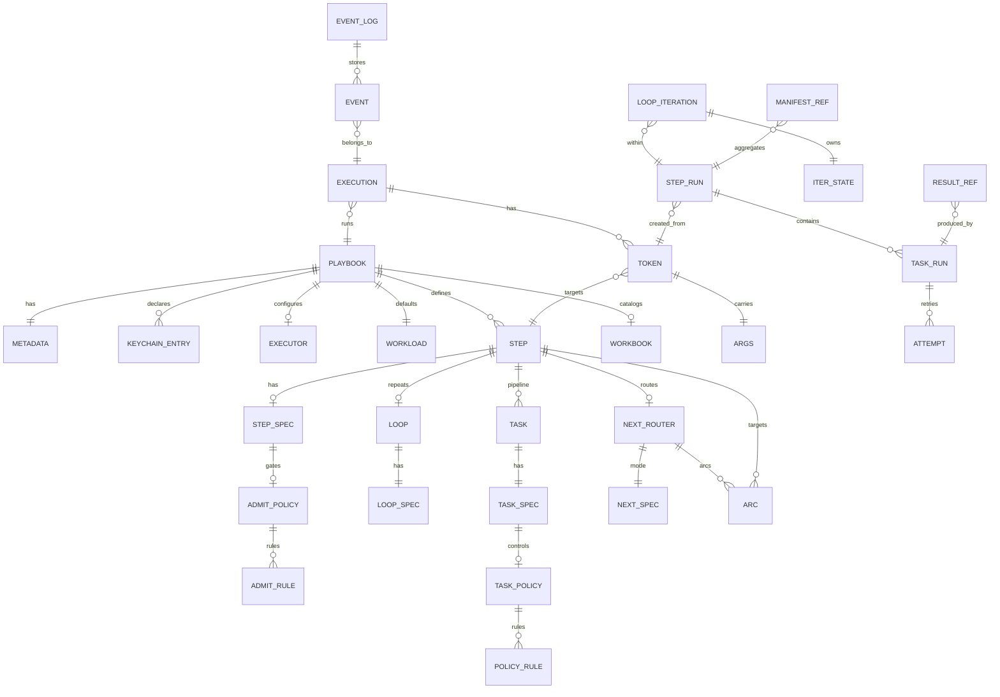

# NoETL DSL Mental Model (Conceptual “ER”)

This document is a **conceptual model** distilled from the Canonical v10 DSL reference:
- https://noetl.dev/docs/reference/dsl/noetl_step_spec
- https://github.com/noetl/noetl/tree/master/documentation/docs/reference/dsl

It describes **how the YAML objects relate**, how they become **runtime instances**, and how **events + result references** make execution durable.

---

## 1) The three-layer mental model

### A) Document model (what you write in YAML)

- **Playbook** = `metadata` + optional `keychain` + optional `executor` + `workload` + `workflow` (+ optional `workbook`).
- **Workflow** = list of **steps** that form a directed graph via `next.arcs[]`.
- **Step** = **(admission policy)** + **(ordered tool pipeline)** + **(next router)**, optionally with a **loop** fan-out.
- **Task** = a labeled tool invocation in the pipeline, with **task policy** that maps `outcome` → directive (`continue|retry|jump|break|fail`) and can patch `ctx`/`iter`.

### B) Runtime model (what executes)

Assuming the project architecture:
- **Worker (`worker.py`)**: pure background worker pool with no HTTP endpoints
- **Server (`server.py`)**: orchestration + API endpoints
- **CLI (`clictl.py`)**: manages worker pools and server lifecycle

Runtime “state namespaces” that templates read from:

- `workload.*` — immutable merged inputs (defaults + invocation payload)
- `ctx.*` — execution-scoped mutable patches
- `iter.*` — iteration-scoped mutable state (only inside loops)
- `args.*` — token payload coming from `next.arcs[].args`

### C) Telemetry/storage model (event sourcing + refs)

- Every meaningful transition is recorded as an **event**.
- **Server emits scheduling/routing events**; **worker emits execution events**.
- Outputs are **reference-first**: inline only if small, otherwise a **ResultRef** pointing to external storage; large aggregates use **Manifest refs**.

---

## 2) ER-style diagram (conceptual)

> Tip: paste this Mermaid block into any Mermaid-enabled renderer (GitHub, Mermaid Live Editor, etc.).

---

## 3) What “locks” the model together (core invariants)

1. **Server is the only step scheduler.**  
   Workers execute assigned step runs but **must not start steps** themselves.

2. **Step routing is Petri-net style.**  
   A step’s `next.arcs[]` fires on boundary events (like `step.done`, `loop.done`) and can carry `args` as the **token inscription** to the next step.

3. **Loops create many iterations, each with isolated `iter.*`.**  
   Fan-out can be parallel/distributed, while inner work stays deterministic per iteration.

4. **Task policy is the “control flow inside a step.”**  
   Policy maps `outcome` to deterministic directives (`retry/jump/break/...`) and can patch `set_ctx` / `set_iter`.

5. **Reference-first outputs prevent event-log bloat.**  
   Tasks yield inline results only when small; otherwise return `ResultRef`, and big aggregations become `Manifest` refs.

---

## 4) Walk-through: token → step → events (one lifecycle)

1. **Execution request** arrives at the **server**.  
   Server merges playbook `workload` defaults + invocation payload into immutable `workload.*`.

2. Server creates a **token** targeting an initial step.

3. Server evaluates **admission policy** (`step.spec.policy.admit`).  
   If admitted, server schedules the step (creates `STEP_RUN`) and emits scheduling/routing events.

4. **Worker** executes the step’s **pipeline** (ordered tasks).  
   Each task emits `task.*` events and produces either inline output or a `ResultRef`.

5. When the step boundary is reached (e.g., `step.done`, `loop.done`), the **server** evaluates `next.arcs[]`.  
   For each satisfied arc, server emits `next.evaluated` and creates new tokens with `args.*`.

---

## 5) A quick glossary (names vary, concepts stay)

- **Playbook**: top-level document defining workflow graph + defaults.
- **Step**: a node in the workflow graph; runs a pipeline of tasks; routes to next nodes.
- **Task**: a single tool invocation inside a step pipeline.
- **Loop**: iterator/fan-out mechanism; introduces `iter.*` scope.
- **Arc**: edge in the workflow graph; may include `when` + `args`.
- **Token**: runtime message/inscription representing “permission to fire” a step.
- **Events**: durable log of scheduling + execution.
- **ResultRef / Manifest**: externalized outputs referenced from events/results.

---

## 6) Suggested “tables-first” projection (optional)

If you project this model into a relational schema, the common durable entities are:

- `playbook` (metadata + version)
- `playbook_step` (step definitions)
- `playbook_arc` (graph edges)
- `execution` (run instance)
- `token` (routing tokens)
- `step_run`, `task_run`, `attempt`
- `event_log` (append-only)
- `result_ref`, `manifest_ref` (external storage references)

This aligns well with:
- Postgres for authoritative scheduling state
- ClickHouse/VictoriaLogs for event analytics
- Object storage for `ResultRef` / `Manifest` payloads

---

## 7) Notes for implementers

- Keep worker stateless beyond transient execution context; server owns orchestration.
- Keep events append-only; build read models/projections asynchronously.
- Prefer references for large results; store only hashes/refs in events.
- Treat `args.*` as the *official* “edge payload” and keep it explicit.

---

*Generated for NoETL DSL documentation mental model.*
